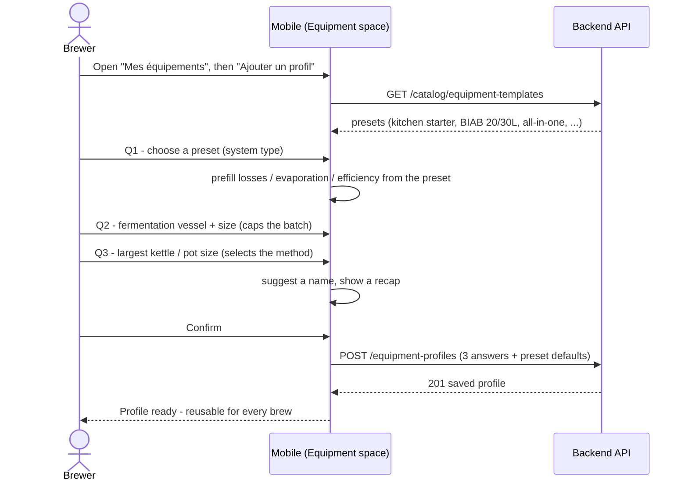

# Sequence diagram — equipment-cleaning — Declare an equipment profile (guided wizard)

> **Feature**: equipment-cleaning epic — the guided 3-question profile wizard.
> **Realizes**: UC1 (with «include» UC2). **Related ADRs**: ADR-0021, ADR-0020.

## Context

How a novice creates a **reusable** equipment profile **from a preset** with minimal questions. The API (`equipment_profiles`, CRUD per user) and the **`equipment_templates`** catalog already exist; this is the missing mobile capture. Only 3 essentials are asked; losses / evaporation / efficiency are inherited from the chosen preset (invisible until the ADR-0020 volume calc lands).

## Diagram

## Notes

- **Guided / progressive (ADR-0021):** one question at a time; the preset prefills everything else, so a beginner answers only **3** essentials (type, fermenter, kettle). Advanced fields (losses, efficiency) stay editable later, hidden by default (adaptive pedagogy).
- **Reuse, not per-recipe:** a profile is created **once** and reused; it is **not** tied to a recipe (no recipe↔equipment relation — the gear is the brewer's). Multi-fermenter is out of v1 (enter the vessel you ferment in).
- The **fermenter size** captured here caps the batch and the recipe target-volume slider (ADR-0020 D1, ADR-0021 D3). The **kettle size** selects full-volume vs dunk-sparge (ADR-0020 D2) — consumed by the fit-check (03).
- Inline help + a glossary explain each term ("fermenteur", "empâtage", "dunk-sparge") in beginner language, with academy links (ADR-0021 D5).
