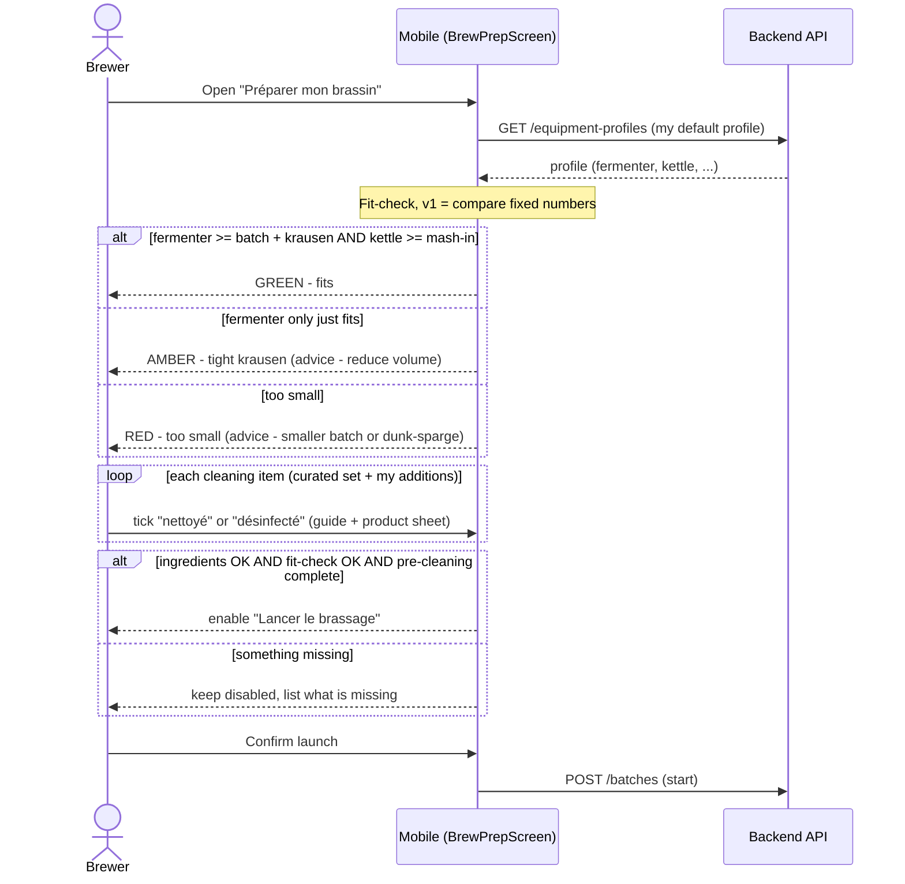

# Sequence diagram — equipment-cleaning — Fit-check & clean before launch

> **Feature**: equipment-cleaning epic — pre-launch equipment readiness (fit-check + cleaning).
> **Realizes**: UC3 + UC4; refines the brew-prep ([`../brew-prep/02-sequence-plan-and-confirm.md`](../brew-prep/02-sequence-plan-and-confirm.md)) launch gate.
> **Related ADRs**: ADR-0021, ADR-0020.

## Context

On the existing `BrewPrepScreen` (PR #1266), "equipment readiness" is **not** a possession checklist — it is a **capacity fit-check** against the declared profile **plus** the **cleaning** ritual. Both, with the ingredient checklist, gate the irreversible launch.

## Diagram

## Notes

- **Equipment readiness = fit-check + cleaning, NOT possession (ADR-0021 D2).** The gear is already declared (the profile); re-ticking owned vessels every brew is pointless. The per-brew act is verifying **capacity fit** + **cleaning**.
- **Graded fit-check + advice (ADR-0021 D2):** green / amber / red with an action, not a binary pass/fail — it educates the novice. v1 compares fixed recipe numbers vs the profile's capacities (no ADR-0020 recompute; deferred).
- **Cleaning = guide + hybrid checklist (ADR-0021 D4):** a curated beginner set (fermenter, airlock + bung, spoon, funnel, hydrometer, thermometer, ...) + adjustable; clean (residues) vs sanitize (no-rinse, e.g. Star San); instructions adapt to the brewer's **declared products**.
- **Refines brew-prep UC6:** `readyToLaunch = ingredientChecklist.isComplete() && fitCheck.ok() && preCleaning.isComplete()` — supersedes the placeholder "equipmentChecklist.isComplete()".
- **Open (ADR-0021):** sanitizing the post-boil gear is ideally **just-in-time** (during cooling, just before transfer) — a brew-day (phase B) placement; the pre-launch gate may instead confirm "ready to sanitize at transfer". Flagged; settled when B1 is built.
