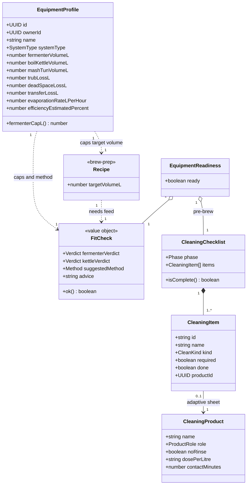

# Class diagram — equipment-cleaning — equipment profile, fit-check & cleaning model

> **Feature**: equipment-cleaning epic — the domain model.
> **Refines**: brew-prep ([`../brew-prep/04-class.md`](../brew-prep/04-class.md)).
> **Related ADRs**: ADR-0021 (this epic), ADR-0020 (volume planning).

## Context

The durable, reusable **`EquipmentProfile`** (mapped to the `equipment_profiles` API entity), how it produces a **`FitCheck`** for a brew, and the beginner **cleaning** model (`CleaningChecklist` / `CleaningItem` / `CleaningProduct`). Equipment readiness is **redefined** as fit-check + cleaning (not a possession checklist).

## Diagram

## Notes

- **`EquipmentProfile` maps 1:1 to the API entity** (`equipment_profiles`). The v1 wizard captures `systemType`, `fermenterVolumeL`, `boilKettleVolumeL` (the API field names; brew-prep's conceptual `fermenterCapacityL` / `kettleCapacityL` are these same fields); the rest (losses, evaporation, efficiency) are **inherited from the chosen preset** (`equipment_templates`) and editable later. `fermenterCapL() = fermenterVolumeL × (1 − headspaceRatio)`.
- **`FitCheck` is a Value Object** (graded verdicts + advice), computed mobile-side in v1 from fixed recipe numbers vs the profile (no ADR-0020 recompute — deferred). `Verdict = {FITS, TIGHT_KRAUSEN, TOO_SMALL}`; `Method = {FULL_VOLUME, DUNK_SPARGE}` (shared with brew-prep / ADR-0020). `ok() = fermenterVerdict ≠ TOO_SMALL && kettleVerdict ≠ TOO_SMALL`.
- **Cleaning model:** `CleanKind = {CLEAN, SANITIZE}`; `Phase = {PRE_BREW, POST_BREW}`; `ProductRole = {CLEANER, SANITIZER}`. Items = **hybrid** (curated beginner set + user-added). `CleaningProduct` is **declared by the brewer** (light inventory — *which* products, no quantities; full stock deferred, unified with ingredients in a later inventory epic); it drives an **adaptive sheet** (dose / contact time / rinse-or-not). The shared `ChecklistRow` UI primitive renders both ingredient (brew-prep) and cleaning items.
- **Equipment readiness redefined (ADR-0021 D2):** `EquipmentReadiness.ready = fitCheck.ok() && preCleaning.isComplete()` — replaces the brew-prep placeholder "equipmentChecklist.isComplete()". The launch gate becomes `ingredientChecklist.isComplete() && EquipmentReadiness.ready` (refines brew-prep `BrewReadiness.readyToLaunch`).
- **Volume cap (ADR-0021 D3):** the profile **caps `Recipe.targetVolumeL`** (≤ `fermenterCapL()`); v1 = a UI ceiling on the existing slider, not the full ADR-0020 cascade (deferred).
- **No recipe↔equipment relation:** equipment is the **brewer's**, owned via `ownerId`; recipes never declare equipment — the gap that triggered this epic.
- **Pedagogy** (`BrewerLevel = {NOVICE, INTERMEDIATE, CONFIRMED}`, declared at onboarding) tunes guide intrusiveness — a cross-cutting concern, not drawn here (ADR-0021 D5).
