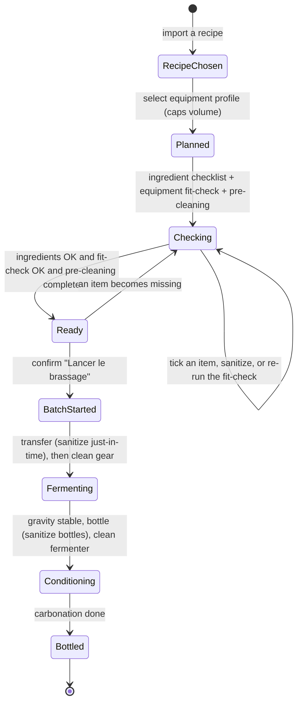

# State diagram — equipment-cleaning — readiness gate with cleaning, through bottling

> **Feature**: equipment-cleaning epic — the pre-batch gate (refined) + where cleaning sits across the lifecycle.
> **Extends**: brew-prep ([`../brew-prep/05-state-readiness.md`](../brew-prep/05-state-readiness.md)).
> **Related ADRs**: ADR-0021, ADR-0020.

## Context

Refines the brew-prep readiness gate so equipment readiness = **fit-check + pre-cleaning** (not a possession checklist), and maps where **cleaning** sits across the brew lifecycle (pre and post). Everything before `BatchStarted` is reversible; after it is owned by the brewing-session epic (phase B), shown lightly here only to place the cleaning + educational-wait phases.

## Diagram

## Notes

- **Readiness gate refined (ADR-0021 D2):** the `Checking → Ready` guard is now `ingredients complete AND fitCheck.ok AND preCleaning complete` — equipment readiness = **fit-check + cleaning**, not a possession checklist (supersedes brew-prep `05` "both checklists complete").
- **Profile is a precondition** of `Planned`: no profile → no fit-check, no volume cap. Auto-selected if the brewer has a single profile.
- **Cleaning placement (open, ADR-0021):** sanitizing post-boil gear is best **just-in-time** (during cooling, before transfer) — a phase-B brew-day step; pre-cleaning at the gate covers preparation / availability. **Post-brew cleaning** (kettle after the brew day; fermenter after transfer; bottle sanitizing at bottling) is shown on the later transitions; detailed when phase B is built.
- **Phase B** (`Fermenting`, `Conditioning`, `Bottled`) belongs to the brewing-session epic — shown only to place the cleaning + educational-wait phases (fermentation end = **gravity stable, not calendar**; ADR-0021 D5). `BatchStarted` remains the **irreversible** boundary (brew-prep).
