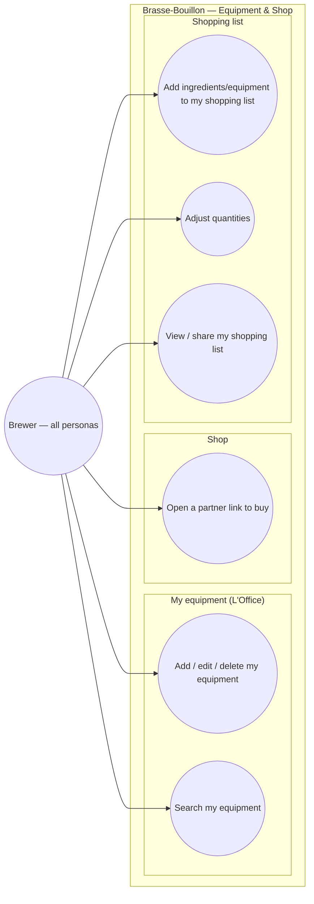

# Use-case diagram — equipment & shop — gear, shopping list & buying

> **Feature**: equipment "L'Office" CRUD #621; local cart/shopping list #653;
> affiliate links #650. Catalog browsing is **not** modelled here — see
> [`../ingredients/01-use-case.md`](../ingredients/01-use-case.md) UC1–UC3.
> **Refonte**: equipment + shop are reached from the Profile hub (ux-refonte).
> **Personas**: all (need gear + ingredients); Léa (what to buy for batch 1).

## Context

Who manages brewing gear and buys ingredients, and how the shopping list ties
the app together (a recipe's ingredients → things to buy). Grouped by domain.
The cart is **local** (a shopping list), not a checkout — purchase happens at a
partner (#650).

**The Shop does not own a browse use case.** It used to declare "Browse the shop
by category" + "View a product", which duplicated the ingredients catalog's
UC1/UC3: the brewer's goal is *consult the ingredient catalog*, and whether the
door is labelled "Ingrédients" or "Boutique" is information architecture, not an
actor goal (UML 2.5 — a use case is a goal, not a screen). Those duplicated UCs
were the reason the app shipped two catalogs, one of them fake. The Shop is now
the **entry point** to the ingredients catalog; the goal itself stays in the
ingredients domain. See [`03-component.md`](03-component.md) for the wiring.

## Diagram

> UC numbering is kept stable (UC3/UC4 retired, not renumbered) so existing
> references in issues and PRs keep resolving.

## Notes / suggestions

- **Status**: nothing in this diagram is built. Equipment is read today, CRUD is
  #621. The **local cart concept was deleted** in #1444 — it had zero non-test
  callers and its "add to cart" buttons in recipe detail were no-ops; UC6–UC8
  remain the target and must be built from scratch (`LocalCartItem` in
  [`04-class.md`](04-class.md) is a *design*, no longer live code). UC5 (#650)
  needs a partner + prices, which the project does not have yet.
- **Retired UC3/UC4** (browse the shop / view a product): merged into the
  ingredients catalog's UC1–UC3. The shop's fake product catalog was deleted in
  #1444; Lot 1 will route the Shop hub into the real catalog instead of
  mirroring it. Today the hub is still a static placeholder — the retirement is
  a conception decision, not a shipped behaviour.
- **UC6 cross-domain**: the shopping list is fed from a recipe's ingredients
  (recipes domain) and from a scan's "what to buy" (#777) — it is the connective
  tissue between recipe → purchase. **Suggestion**: a single shopping list,
  reachable from the Profile hub, that aggregates items from any recipe/scan.
- **UC5 affiliate (#650)**: deep-link to a partner e-commerce (commission); the
  app does not process payment. **Suggestion** — flag affiliate links clearly
  (transparency) and keep prices labelled "indicatif".
- **`LocalCartItem.source`** distinguishes `ingredient` vs `equipment`, so the
  list groups buy-now ingredients from durable gear.
