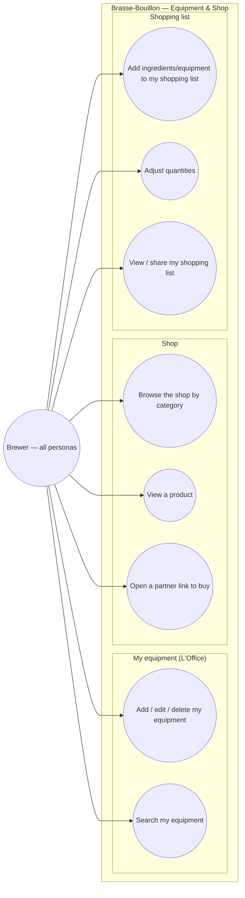

# Use-case diagram — equipment & shop — gear, catalog & shopping list

> **Feature**: equipment "L'Office" CRUD #621; shop catalog (E10, read);
> local cart/shopping list #653; affiliate links #650.
> **Refonte**: equipment + shop are reached from the Profile hub (ux-refonte).
> **Personas**: all (need gear + ingredients); Léa (what to buy for batch 1).

## Context

Who manages brewing gear and shops for ingredients/equipment, and how the
shopping list ties the app together (a recipe's ingredients → things to buy).
Grouped by domain. The cart is **local** (a shopping list), not a checkout —
purchase happens at a partner (#650).

## Diagram

## Notes / suggestions

- **Status**: shop browse/product (UC3/UC4) shipped (read); equipment is read
  today, CRUD is #621; the **local cart concept exists in recipe detail but is
  never visible** (#653) — UC6–UC8 surface it.
- **UC6 cross-domain**: the shopping list is fed from a recipe's ingredients
  (recipes domain) and from a scan's "what to buy" (#777) — it is the connective
  tissue between recipe → purchase. **Suggestion**: a single shopping list,
  reachable from the Profile hub, that aggregates items from any recipe/scan.
- **UC5 affiliate (#650)**: deep-link to a partner e-commerce (commission); the
  app does not process payment. **Suggestion** — flag affiliate links clearly
  (transparency) and keep prices labelled "indicatif".
- **`LocalCartItem.source`** distinguishes `ingredient` vs `equipment`, so the
  list groups buy-now ingredients from durable gear.
