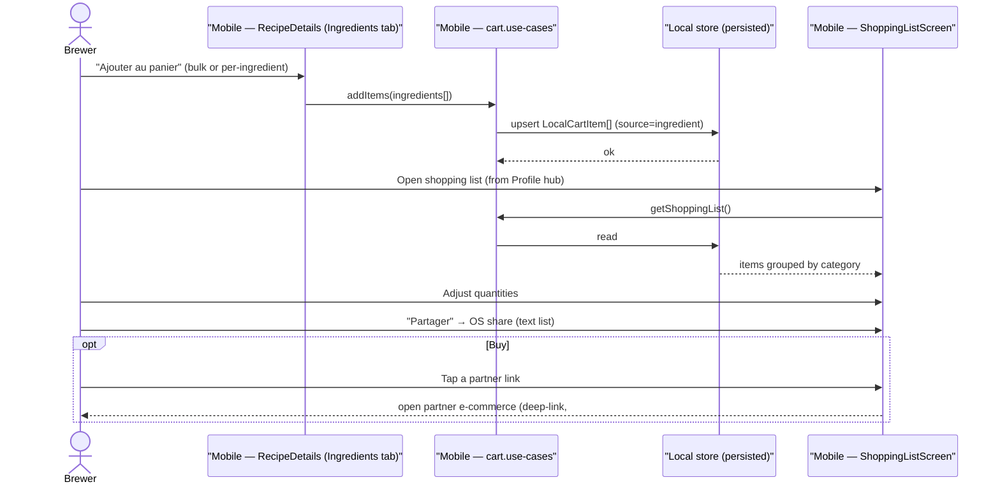

# Sequence diagram — equipment & shop — build & share a shopping list

> **Feature**: local cart/shopping list #653; recipe → buy bridge.

## Context

How the shopping list is built from a recipe's ingredients (the cross-domain
bridge) and then viewed/shared. The list is local; buying is a partner deep-link.

## Diagram

## Notes / suggestions

- **Local & persisted**: the list lives client-side (AsyncStorage), survives app
  restarts. No server order. **Suggestion** — one list per user, appended to from
  any recipe or scan (#777), not a per-recipe ephemeral cart.
- **Grouping**: items group by `ShopCategory` (malts / hops / yeast / equipment)
  so the brewer shops efficiently.
- **Share** is text today (parity with labels share) — a richer export (checklist
  PDF) is a later enhancement.
- **Demo mode**: the list reads/writes the in-memory demo store.
