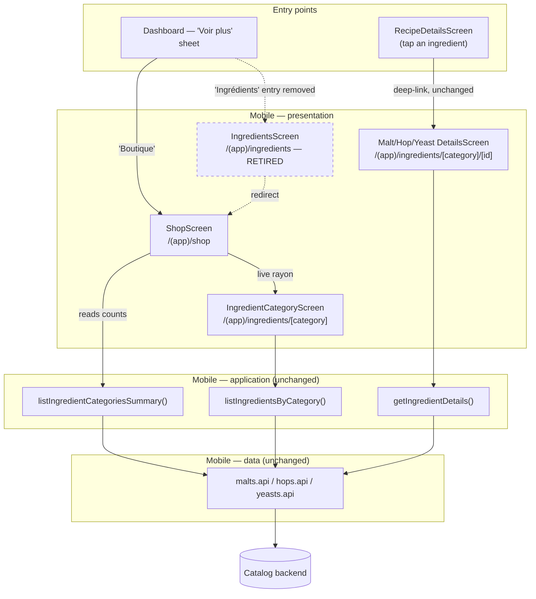

# Component diagram — shop → ingredients catalog wiring

> **Feature**: the Shop hub as the single entry point to the ingredient catalog.
> Supersedes the shop's own (deleted) product catalog — see
> [`01-use-case.md`](01-use-case.md) § retired UC3/UC4.

## Context

Where the catalog actually lives once the Shop stops mirroring it. The decision
is **reuse, not relocation**: the Shop hub reads the existing ingredients
use-cases, and the category/datasheet screens stay exactly where they are.

That constraint is not cosmetic — `RecipeDetailsScreen` deep-links straight into
`/(app)/ingredients/[category]/[id]` and `/(app)/ingredients/malts/[id]` when a
brewer taps an ingredient in a recipe. Moving those routes under `/shop` would
break the recipe → ingredient path and its tests, and buy nothing: the goal is
one *door*, not one *directory*.

So the Shop hub replaces the `/ingredients` **hub** only. Everything below the
hub is shared.

## Diagram

## Notes / suggestions

- **Retired, not deleted twice**: `/(app)/ingredients/index` redirects to
  `/(app)/shop` rather than 404-ing, so any existing deep link or muscle memory
  still lands somewhere sensible. The dashboard's "Ingrédients" entry
  (`DashboardScreen`, `businessRoute("ingredients", …)`) is removed — that is the
  "one door" change.
- **The Shop hub owns no data layer.** It calls
  `listIngredientCategoriesSummary()` for the live rayons' counts, exactly as the
  retired `IngredientsScreen` did. No `features/shop/data/`, no second API
  client, no duplicated types — the whole point of this diagram.
- **Two-speed hub, and the split is about mobile wiring — not missing data.**
  Lot 1 makes three rayons live (Malts / Houblons / Levures) because those are
  the only catalogs the mobile app already consumes. Matériel and Accessoires
  stay inert **for now**, and Kits stays inert **for good** (no source at all).
  A placeholder tile must stay non-pressable — the shop promises nothing it
  cannot deliver (#1444); `ShopScreen.test.tsx` guards this.

- **The backend already serves ten catalogs**, which is more than this feature
  ever used:

  | Rayon | Endpoint | Mobile status |
  |---|---|---|
  | Malts | `/catalog/fermentables` | wired (`malts.api.ts`) |
  | Houblons | `/catalog/hops` | wired (`hops.api.ts`) |
  | Levures | `/catalog/yeasts` | wired (`yeasts.api.ts`) |
  | Accessoires | `/catalog/misc-templates` | `misc.api.ts` **exists but is not wired** into the catalog use-cases |
  | Matériel | `/catalog/equipment-templates` | nothing mobile-side |
  | Kits | — | no source |

  Also unused: `/catalog/styles`, `/catalog/waters`, `/catalog/mash-profiles`,
  `/catalog/producers`, `/catalog/distributors`.

- **Lot 2 — wire the two remaining rayons.** Accessoires is the cheaper of the
  two (`misc.api.ts` already exists; it needs an application layer + a category
  screen + `IngredientCategory` gaining a `misc` member). Matériel needs a full
  data → application → screens slice. Each is its own increment.

- **`/catalog/distributors` is worth a look before UC5 (#650)**: a distributor
  catalog is closer to "a real shop" than an affiliate deep-link, and it already
  has a controller. Nobody has scoped what it holds — do that before designing
  the buy path.

- **Equipment: two different concepts, same word.** `/equipment` (the brewer's
  *own* gear, `/equipment-profiles`, 3Q wizard) is NOT the Matériel rayon
  (`/catalog/equipment-templates`, purchasable models). Wiring the rayon must not
  merge them: owning a Braumeister and browsing Braumeisters are different goals.

- **Naming drift to fix**: `EquipmentScreen` is titled "L'Office 🍽️" while the
  shop's equivalent rayon was renamed "Matériel" in #1449. Same word, two
  concepts, two names, and the emoji is against the sobriety rule. Reconcile when
  the Matériel rayon gets wired.
