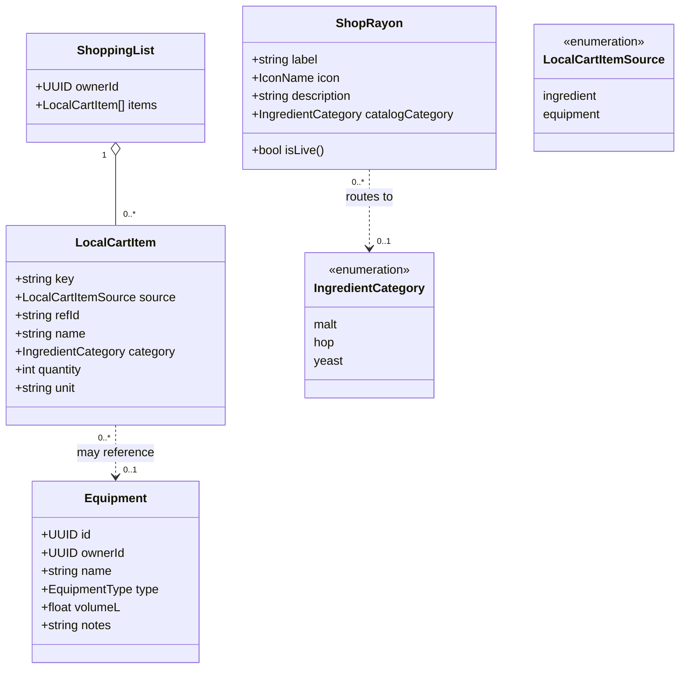

# Class diagram — equipment & shop — gear, rayons, shopping list

> **Feature**: equipment CRUD #621; shop hub rayons; local cart #653.
> **Source**: `features/equipment/domain/equipment.types.ts` (live);
> `features/shop/` (`ShopRayon` = target). `Product` / `PriceUnit` /
> `LocalCartItem` were deleted in #1444 — see § Status.

## Context

The model for owned equipment, the Shop hub's rayons, and the local shopping
list that links recipes/scans to purchases.

**The shop owns no product model.** It used to declare `Product` + `PriceUnit`
mirroring a catalog that the ingredients domain already owned — the class-level
face of the duplicated UC3/UC4 ([`01-use-case.md`](01-use-case.md)). The catalog
entity is `Ingredient` (see [`../ingredients/04-class.md`](../ingredients/04-class.md));
the shop only models **how its hub presents rayons** and routes into that catalog.

## Diagram

## Notes / suggestions

- **Status — what is live vs designed.** `Equipment` is live (read; CRUD is
  #621). `ShopRayon` is the **target** for the hub rework. `ShoppingList` /
  `LocalCartItem` are **design only**: the real `cart.types.ts` was deleted in
  #1444 (zero non-test callers), so #653 builds them from scratch. `Product`,
  `PriceUnit` and the `ShopCategory` enum are **gone** and are not coming back —
  prices do not exist for this project today.
- **`ShopRayon.catalogCategory` is nullable, and that nullability *is* the
  two-speed hub**: a rayon with a category is live and pressable (routes to
  `/(app)/ingredients/[category]`); a rayon without one is an inert "bientôt"
  placeholder. `isLive()` is exactly `catalogCategory != null`. Modelling the
  placeholder as an absent link (rather than a status flag) means an unsourced
  rayon *cannot* be made pressable by accident.
- **Lot 1 wires three rayons; two more are waiting on mobile plumbing, not on
  data.** Malts → `malt`, Houblons → `hop`, Levures → `yeast`. Accessoires
  (`/catalog/misc-templates`) and Matériel (`/catalog/equipment-templates`) are
  served by the backend already but unconsumed mobile-side — Lot 2 adds them, and
  `IngredientCategory` grows a `misc` member for Accessoires. Kits alone has no
  source anywhere. See [`03-component.md`](03-component.md) for the endpoint map.
- **`IngredientCategory` is the shared taxonomy and it will grow.** It is
  `malt | hop | yeast` today; the API's catalog module is wider (fermentable /
  hop / yeast / misc / equipment / style / water / mash / producer / distributor).
  Growing this enum is how a rayon goes live — not by adding a shop-side type.
- **`LocalCartItem.category` is now `IngredientCategory`**, not the retired
  `ShopCategory` — one taxonomy for the whole app.
- **Item → catalog link is optional**: a custom ingredient (Strategy B, #915)
  added to the list may not map to a catalog entry — keep `refId` generic so
  off-catalog items are listable (name + quantity).
- **No payment/order entity**: purchase is a partner deep-link (#650) — out of
  the model on purpose, and blocked on having a partner and prices at all.
