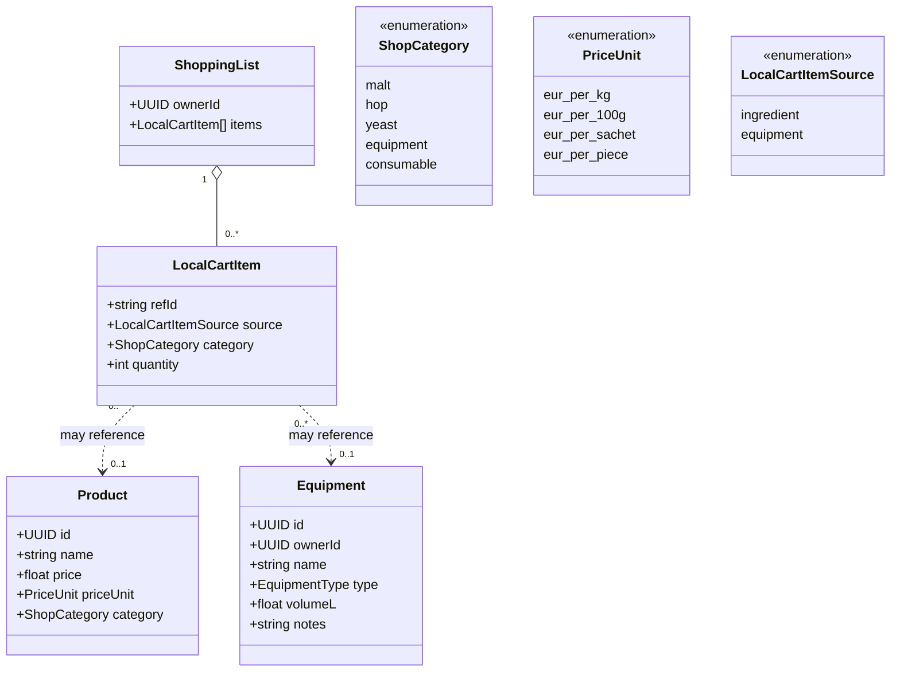

# Class diagram — equipment & shop — gear, products, shopping list

> **Feature**: equipment CRUD #621; shop catalog E10; local cart #653.
> **Source**: `features/shop/domain/shop.types.ts`, `cart.types.ts`.

## Context

The model for owned equipment, the shop product catalog, and the local shopping
list that links recipes/scans to purchases. Reflects the existing shop/cart types;
`Equipment` CRUD fields are the #621 addition.

## Diagram

## Notes / suggestions

- **Existing**: `Product` (price/priceUnit/category), `LocalCartItem`
  (source/quantity), `ShopCategory`, `PriceUnit` are real. `Equipment` fields +
  `EquipmentType` are the #621 CRUD addition (today equipment is read-only demo).
- **`ShoppingList` is local** (the "cart" that was never surfaced, #653) — not a
  server order. **Suggestion**: persist it per user (so it survives reinstall)
  and let any recipe/scan append to the *same* list.
- **Item → catalog link is optional**: a custom ingredient (Strategy B) added to
  the list may not map to a `Product` — keep `refId` generic so off-catalog items
  are listable (name + quantity).
- **No payment/order entity**: purchase is a partner deep-link (#650) — out of
  the model on purpose.
