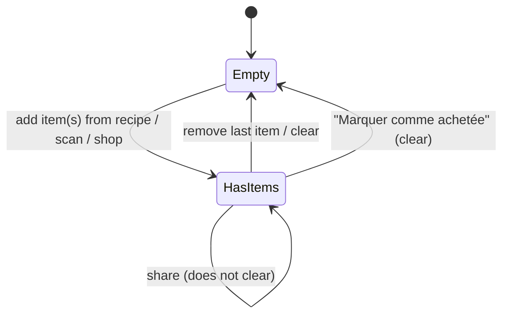

# State diagram — equipment & shop — shopping list lifecycle

> **Feature**: local cart/shopping list #653.

## Context

The local shopping list's lifecycle. Light, but worth naming so "empty" vs
"has items" drives the UI (empty state vs list + share), and clearing is explicit.

## Diagram

## Notes / suggestions

- **Share does not clear** the list (you may share and keep shopping). Only an
  explicit clear or "marquer comme achetée" empties it.
- **Empty state** is a real UI concern (#621 mentions empty states for equipment
  too) — the screen shows guidance ("ajoute des ingrédients depuis une recette")
  rather than a blank list.
- **Equipment ("L'Office")** has no list lifecycle — it is a managed collection
  (CRUD), so no state machine; only the shopping list has one.
- **Suggestion**: a "purchased history" (what I bought, when) could grow from the
  clear action later — out of scope now (YAGNI), but the clear transition is the
  natural hook.
