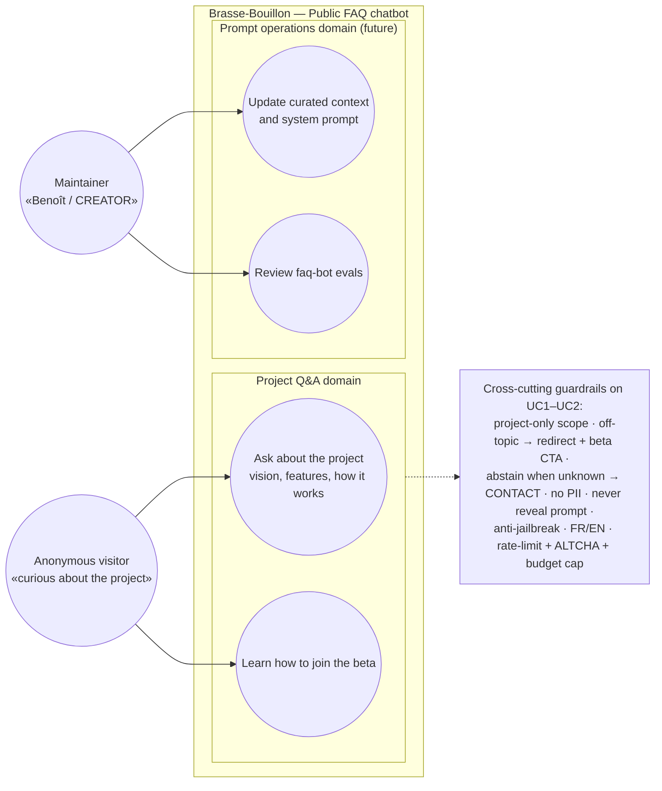

# Use case diagram — faq-bot — actors and goals

> **Feature**: public **project FAQ chatbot** on the website (LLM-backed via **Mistral**,
> API-proxied). Anonymous visitors; scope = the brasse-bouillon project only.
> **Related ADRs**: [ADR-0022](../../decisions/0022-public-faq-chatbot-llm.md) (this feature),
> [ADR-0002](../../decisions/0002-centralized-nestjs-backend.md) (proxy),
> [ADR-0003](../../decisions/0003-consent-single-source-of-truth.md) /
> [ADR-0012](../../decisions/0012-rgpd-anonymize-authored-public-content.md) (RGPD),
> reserved [ADR-0008](../../decisions/) (AI-generated content policy).

## Context

Highest-level view of **who talks to the public FAQ bot and to do what**. It answers
*"who wants what?"* and deliberately does **not** show:

- Temporal flow (widget → API → Mistral) — see [02-sequence-ask.md](02-sequence-ask.md).
- Structure (controller ↔ service ↔ port ↔ Mistral adapter, widget) — see [03-component.md](03-component.md).

The actor is an **anonymous visitor** (no login). Goals are grouped by **domain** (project
Q&A). Guardrails (project-only scope, no PII, abstain→contact, anti-jailbreak, FR/EN,
anti-abuse) are **constraints on every goal**, shown as a note.

## Diagram

## Notes

- **UC1–UC2** are the v1 scope. **UC3–UC4** are maintainer goals served by the eval harness and
  the curated `context.md`, not runtime endpoints.
- Out of scope (declined + redirected): anything non-project, medical/legal advice, another
  user's data, hard dates / monetization / internal technical details.
