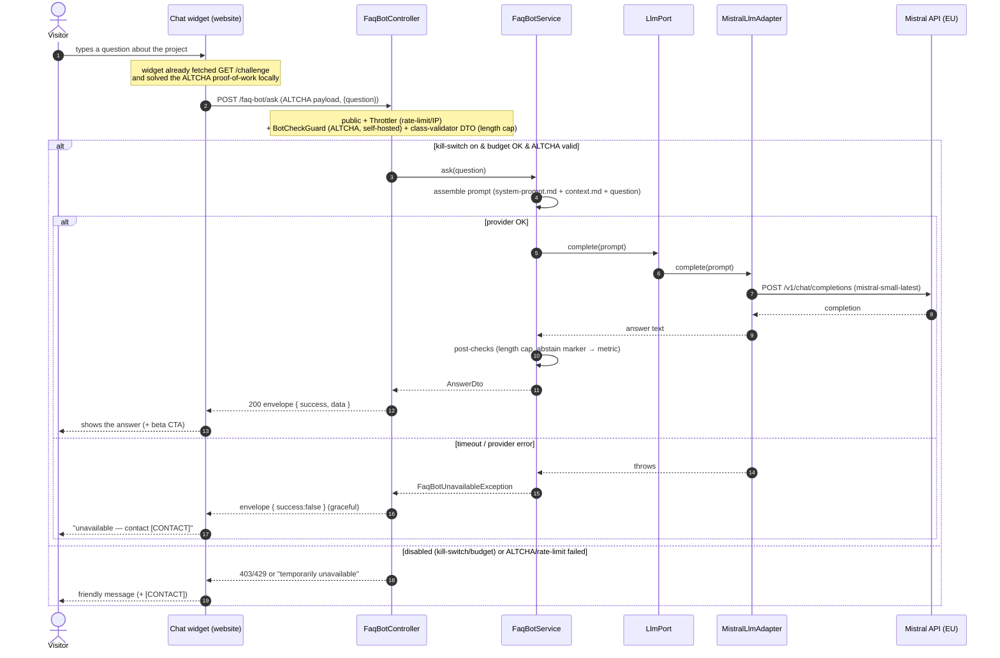

# Sequence diagram — faq-bot — "Ask about the project"

> **Feature**: public FAQ bot — nominal flow for UC1/UC2 (a visitor asks a question).
> **Related ADRs**: [ADR-0022](../../decisions/0022-public-faq-chatbot-llm.md),
> [ADR-0002](../../decisions/0002-centralized-nestjs-backend.md).

## Context

Temporal flow of one question, **website widget → API (public, proxied) → Mistral → API →
widget**. It shows where each control sits: the ALTCHA bot-check, throttler/rate-limit, DTO
validation, kill-switch/budget, the `LlmPort` seam, post-checks, the response envelope, and
graceful fallback. Structure in [03-component.md](03-component.md); goals in
[01-use-case.md](01-use-case.md).

## Diagram

## Notes

- The **Mistral key** is used only inside `MistralLlmAdapter` (server-side) — ADR-0002.
- **No history** (one-shot) and **no content logged** — anonymous metadata only (latency, tokens).
- The **ALTCHA** proof-of-work payload is verified server-side in `BotCheckGuard` via `altcha-lib`
  with our own HMAC secret — **no third-party call** (self-hosted, EU-sovereign). Solved proofs
  are **single-use**: a replayed proof is rejected (in-memory, TTL = the challenge lifetime).
  When no secret is configured the guard bypasses **only in dev/test** and **fails closed**
  (503) anywhere else, so a misconfigured deploy never exposes the paid endpoint.
