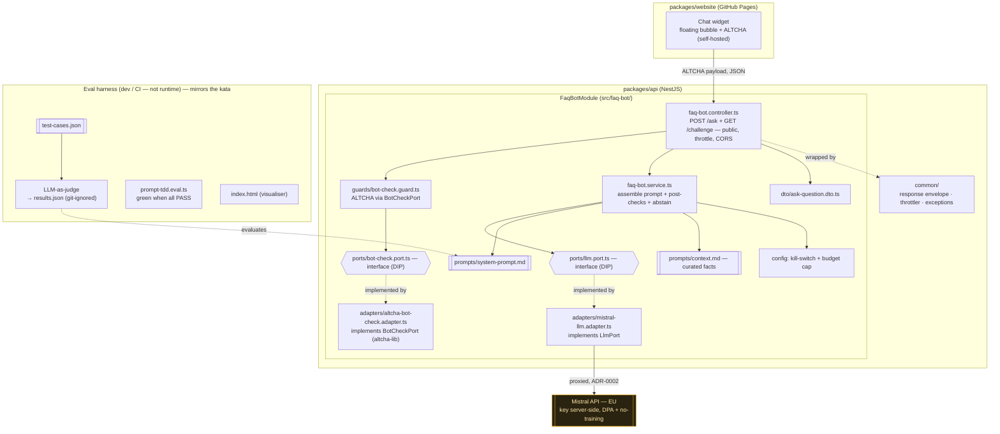

# Component diagram — faq-bot — structure

> **Feature**: public FAQ bot — module structure, the LLM boundary (Mistral), the anti-bot
> boundary (ALTCHA, self-hosted), and the widget.
> **Related ADRs**: [ADR-0022](../../decisions/0022-public-faq-chatbot-llm.md),
> [ADR-0002](../../decisions/0002-centralized-nestjs-backend.md),
> [ADR-0019](../../decisions/0019-testing-strategy-and-quality-gates.md).

## Context

Structural decomposition: the website **chat widget**, the NestJS **module**, the
**port/adapter** seams to **Mistral** (LLM) and **ALTCHA** (bot-check), the anti-abuse controls,
the shared cross-cutting concerns, and the **eval harness** (dev/CI, not runtime). Flow in
[02-sequence-ask.md](02-sequence-ask.md); goals in [01-use-case.md](01-use-case.md).

## Diagram



## Folder layout (self-contained — nothing mixed with other modules)

```text
packages/api/src/faq-bot/            # the WHOLE bot lives here
├── faq-bot.module.ts                # bind LlmPort → MistralLlmAdapter, BotCheckPort → AltchaBotCheckAdapter; wire guard/config
├── faq-bot.controller.ts            # POST /ask + GET /challenge (public, throttle, CORS, envelope)
├── faq-bot.service.ts               # assemble system-prompt + context + question; post-checks; abstain
├── ports/llm.port.ts                       # LLM interface (DIP) — the Mistral seam
├── ports/bot-check.port.ts                 # bot-check interface (DIP) — the ALTCHA seam
├── adapters/mistral-llm.adapter.ts         # implements LlmPort (Mistral REST via fetch, key via env, EU)
├── adapters/altcha-bot-check.adapter.ts    # implements BotCheckPort (altcha-lib, HMAC secret, self-hosted)
├── guards/bot-check.guard.ts               # verifies the ALTCHA payload via BotCheckPort (bypass if no secret)
├── dto/ask-question.dto.ts                # class-validator (question non-empty, length-capped)
├── exceptions/faq-bot-unavailable.exception.ts
├── config/faq-bot.config.ts         # kill-switch flag + monthly budget cap + secrets
├── metrics/faq-bot.metrics.ts       # in-memory anonymous counters (no free-text logged)
├── prompts/system-prompt.md                # persona + guardrails (the spec)
├── prompts/context.md                      # curated project facts (versioned, manual updates)
├── evals/                                  # prompt-TDD harness (dev/CI, not runtime)
│   ├── AGENT.md · test-cases.json · results.schema.json
│   ├── results.example.json · index.html · prompt-tdd.eval.ts
└── *.spec.ts                               # H/S/E unit tests, colocated (LLM + bot-check mocked)
```

## Notes

- **Isolation**: every bot artifact is under `src/faq-bot/`; the widget is the only piece
  in `packages/website`. Only outside touch points: shared `common/` concerns (envelope,
  throttler, exceptions) used by all modules.
- **Dependency rule (DIP)**: `Service` depends on `LlmPort`, the guard on `BotCheckPort` — never
  on Mistral or ALTCHA directly. Provider swap = a new adapter; unit tests inject fakes.
- **ALTCHA is self-hosted** (`altcha-lib`): the challenge is created and verified in-process with
  our HMAC secret — no third-party call, EU-sovereign (replaces Cloudflare Turnstile).
- **Prompt + context** are the units under test of the eval harness (prompt-as-spec).
- Eval harness is **out of the unit pyramid** (ADR-0019): on-demand / dedicated CI job.
- Layering **proportional** (ADR-0001): `ports/` + `adapters/` seams, no speculative 3-tier tree.
