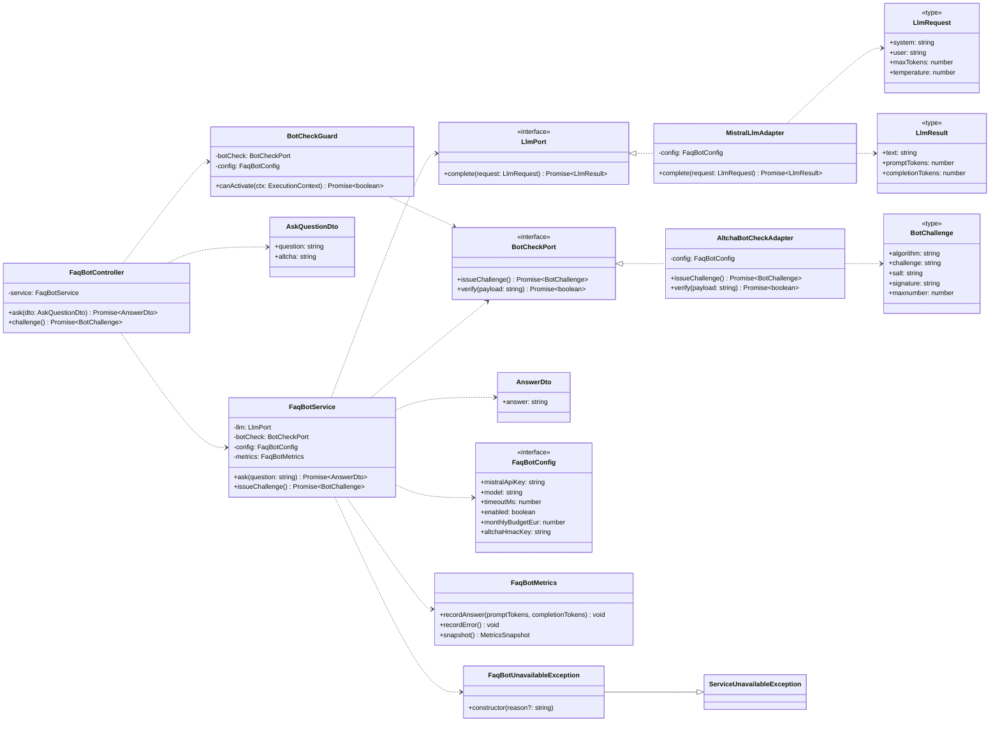

# Class diagram — faq-bot — code contract (ports, adapters, DTOs)

> **Feature**: public FAQ bot — the **structural contract** the implementation must satisfy
> (DIP seams, DTOs, config, exception). This is the UML-first target for the code layer.
> **Related ADRs**: [ADR-0022](../../decisions/0022-public-faq-chatbot-llm.md),
> [ADR-0002](../../decisions/0002-centralized-nestjs-backend.md),
> [ADR-0001](../../decisions/0001-build-for-today-design-for-tomorrow.md) (proportional layering).

## Context

Detail behind [03-component.md](03-component.md): the exact interfaces, their implementations,
and the request/response shapes. Two DIP seams — `LlmPort` (Mistral) and `BotCheckPort`
(ALTCHA) — let unit tests inject fakes and keep the service/guard provider-agnostic. Flow in
[02-sequence-ask.md](02-sequence-ask.md); goals in [01-use-case.md](01-use-case.md).

## Diagram

## Notes

- **DIP**: `FaqBotService` depends on `LlmPort`; `BotCheckGuard` depends on
  `BotCheckPort`. Neither imports Mistral or ALTCHA — the module binds `useClass` to the
  adapters. Unit tests inject fakes for both ports (boundaries mocked, ADR-0019).
- **DTO validation** (`AskQuestionDto`): `question` is `@IsString @IsNotEmpty @MaxLength(500)`
  (trimmed); `altcha` is `@IsString @IsOptional` (the payload the guard verifies).
- **`ask()` responsibilities**: kill-switch/budget gate (→ `FaqBotUnavailableException`),
  assemble `system` + `context` + `question` into an `LlmRequest`, call `LlmPort`, run minimal
  post-checks (output length cap, abstain-marker → metric). No conversation content is logged.
- **`issueChallenge()`** delegates to `BotCheckPort` — the controller stays thin
  (controller → service → ports).
- **Proportional layering** (ADR-0001): interfaces live in `ports/`, implementations in
  `adapters/`; no extra speculative layers.
