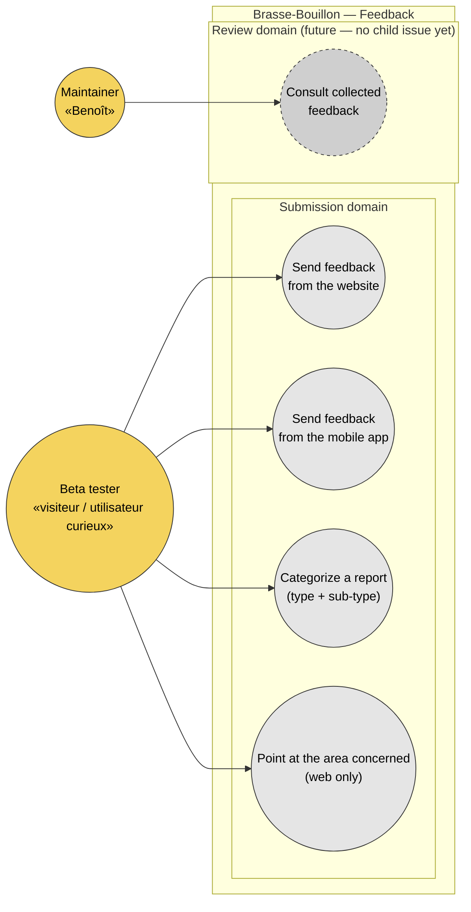

# Use case diagram — feedback — actors and goals

> **Feature**: epic [#1026](https://github.com/benoit-bremaud/brasse-bouillon/issues/1026) — beta distribution + in-product feedback loop.
> **Children**: [#1028](https://github.com/benoit-bremaud/brasse-bouillon/issues/1028) (website widget), [#1029](https://github.com/benoit-bremaud/brasse-bouillon/issues/1029) (in-app feedback), [#1027](https://github.com/benoit-bremaud/brasse-bouillon/issues/1027) (API endpoint).
> **Reused tool**: the `feedback-widget` project (private repo) — hexagonal `core` + `web` adapter, RN adapter tracked as feedback-widget#15.
> **Related ADRs**: [ADR-0002](../../decisions/0002-centralized-nestjs-backend.md), [ADR-0003](../../decisions/0003-consent-single-source-of-truth.md).

## Context

Highest-level view of **who interacts with the feedback feature and to do what**. Scoped to epic #1026. It answers *"who wants what?"* and deliberately does **not** show:

- Structural decomposition (core ↔ web/RN adapters ↔ NestJS API) — see [03 component diagram](03-component.md).
- Temporal flow (build payload → POST → persist → confirm) — see [02-sequence-submit.md](02-sequence-submit.md).
- Field-level data + PII — see [06 data flow](06-data-flow.md).

The single actor-initiated goal that matters is **"send a piece of feedback"**, expressed on two surfaces (website, mobile app). Categorizing and pointing at a block are sub-goals of the same submission. The maintainer's *consult* goal is shown as a future domain — no review screen ships in the current children.

## Diagram

## Notes

### UML 2.5 orthodoxy applied

- **Use cases grouped by domain** (`Submission`, `Review`), never by surface (web/app) nor by package. The web-vs-RN adapter split lives in [03 component diagram](03-component.md). UC1 and UC2 are two distinct use cases only because they reflect two distinct user experiences (a site visitor vs an app user mid-use); the underlying goal is the same.
- **"Send feedback" is the actor-initiated goal.** The widget's *retry / offline drain* (the outbox) is **not** a use case — it is a system behaviour triggered automatically when the network fails. It appears nowhere here; it is captured in the [02 sequence](02-sequence-submit.md) and [03 component](03-component.md) diagrams.
- **`UC3 — Categorize` and `UC4 — Point at the area` are sub-goals of a submission**, surfaced separately because they are explicit steps the actor performs (choosing a category, optionally pointing at a block). UC4 is web-only — the RN adapter has no DOM block-pointing equivalent.

### Anti-patterns this diagram makes visible

- **No "Receive feedback confirmation" use case.** Being shown a confirmation is a system response, not an actor goal — it would violate the actor-initiated rule.
- **No actor-to-API arrow.** The tester never talks to the NestJS API directly; the widget mediates. The egress is made explicit by the [03 component diagram](03-component.md), per [ADR-0002](../../decisions/0002-centralized-nestjs-backend.md).

### Open questions surfaced by this diagram

- **`UC5 — Consult collected feedback`** has no child issue yet. The current epic only *collects* feedback (persist via #1027). A maintainer review surface is a future scope — promote to a child issue before building it.
- Should an authenticated app user's identity auto-attach to UC2 submissions, or stay anonymous like UC1? This intersects consent ([ADR-0003](../../decisions/0003-consent-single-source-of-truth.md)) — resolve in #1027 before persisting.
