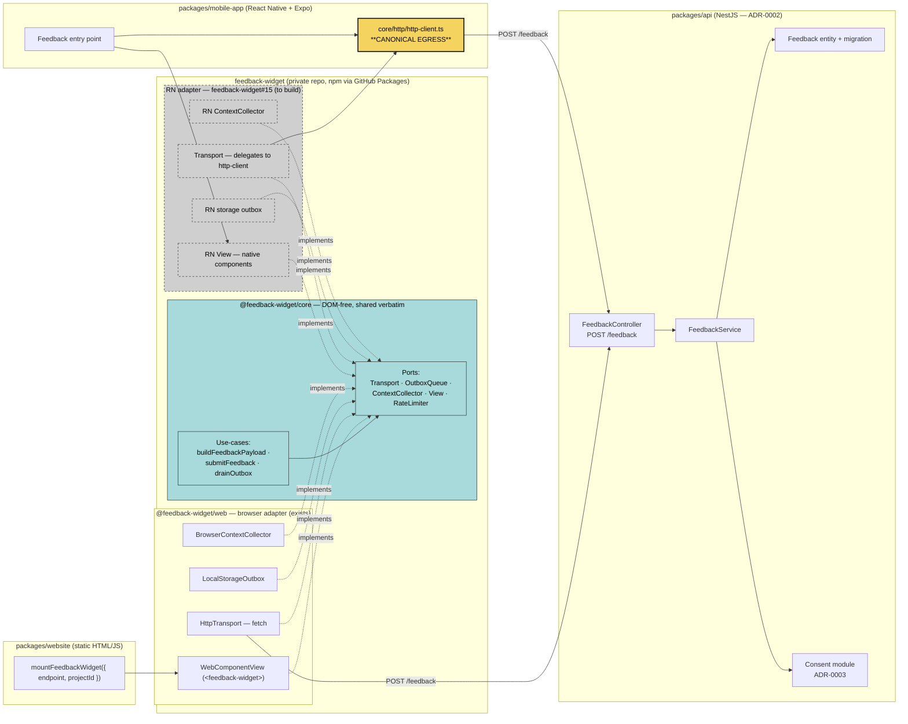

# Component diagram — feedback — structural decomposition

> **Feature**: epic [#1026](https://github.com/benoit-bremaud/brasse-bouillon/issues/1026) — beta distribution + in-product feedback loop.
> **Children**: [#1027](https://github.com/benoit-bremaud/brasse-bouillon/issues/1027) (API endpoint), [#1028](https://github.com/benoit-bremaud/brasse-bouillon/issues/1028) (website widget), [#1029](https://github.com/benoit-bremaud/brasse-bouillon/issues/1029) (in-app RN adapter).
> **Reused tool**: `feedback-widget` (private repo) — `core` ports + use-cases, `web` adapter; RN adapter tracked as feedback-widget#15.
> **Related ADRs**: [ADR-0002](../../decisions/0002-centralized-nestjs-backend.md) (mobile talks only to BB backends, single egress), [ADR-0003](../../decisions/0003-consent-single-source-of-truth.md).

## Context

Structural view of *how the feedback feature is split across packages and where the egress points live*. It answers *"what calls what?"* and makes the **hexagonal reuse** explicit: **one `core`, two adapters (web + RN), one NestJS endpoint**. The use cases ([01](01-use-case-feedback.md)) deliberately did not show this.

Two rules this diagram enforces:

1. The `feedback-widget` `core` is **DOM-free and shared verbatim**; only the ports differ per surface.
2. On mobile, the `Transport` port **must delegate to `core/http/http-client.ts`**, the single mobile egress per [ADR-0002](../../decisions/0002-centralized-nestjs-backend.md) — never a raw `fetch`.

It does **not** show temporal flow ([02 sequence](02-sequence-submit.md)) nor field-level PII ([06 data flow](06-data-flow.md)).

## Diagram

## Notes

### Reuse contract — what this diagram enforces

- **One core, verbatim, on both surfaces.** `@feedback-widget/core` carries every use-case (`buildFeedbackPayload`, `submitFeedback`, `drainOutbox`) and every port. The web adapter exists today; the RN adapter (dashed) is net-new work tracked in feedback-widget#15 — it implements the *same* ports with native components, RN storage, and an RN context collector.
- **Mobile egress is `core/http/http-client.ts`.** The RN adapter's `Transport` does **not** call `fetch` directly — it delegates to `http-client.ts`, the single mobile egress per [ADR-0002](../../decisions/0002-centralized-nestjs-backend.md). The web adapter's `HttpTransport` may POST directly (the website has no equivalent egress rule), which is why only the mobile lane routes through `HTTP`.
- **Consent is a server-side dependency.** `FeedbackService` checks the Consent module ([ADR-0003](../../decisions/0003-consent-single-source-of-truth.md)) before persisting. Persistence from day one — no demo-only path.

### Cross-package call patterns

| From | To | Pattern | Purpose |
|---|---|---|---|
| `website` `mountFeedbackWidget` | `@feedback-widget/web` | npm import (GitHub Packages, private) | Mount the Web Component |
| `@feedback-widget/web` `HttpTransport` | `api` `FeedbackController` | HTTPS POST `/feedback` | Submit from website |
| `mobile-app` RN adapter `Transport` | `mobile-app` `http-client.ts` | in-bundle call | Route submission through canonical egress |
| `mobile-app` `http-client.ts` | `api` `FeedbackController` | HTTPS POST `/feedback`, JWT | Submit from app |
| `api` `FeedbackService` | `api` Consent module | in-process | Gate persistence per ADR-0003 |

### Anti-patterns this diagram makes visible

- **Raw `fetch` in the RN adapter** — would bypass `http-client.ts` and violate ADR-0002. The diagram has no arrow from `RHttp` to `Ctrl`; the only RN path to the API goes through `HTTP`.
- **Forking the core per surface** — the RN adapter must reuse `@feedback-widget/core`, not reimplement validation/payload/rate-limit logic. Any duplicated domain logic in `packages/mobile-app` violates the reuse contract.
- **Confusing this with #571** — #571 embeds a feedback widget on the **Ydays VitePress site** (#565), a different surface and a different project artefact. This diagram is brasse-bouillon.com + the mobile app only.

### Open questions

- Consuming a **private** GitHub Packages dependency in the website CI requires a registry auth step — resolve the `.npmrc` / token wiring in #1028.
- Should the API expose `projectId` as a fixed allow-list (`brasse-bouillon-website`, `brasse-bouillon-app`) to reject stray sources? Decide in #1027.
