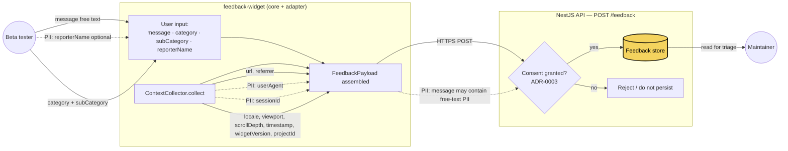

# Data flow diagram — feedback — fields and PII

> **Feature**: epic [#1026](https://github.com/benoit-bremaud/brasse-bouillon/issues/1026) — beta distribution + in-product feedback loop.
> **Children**: [#1027](https://github.com/benoit-bremaud/brasse-bouillon/issues/1027) (API endpoint + persistence + consent).
> **Source types**: `feedback-widget` `core` `FeedbackPayload` = `BrowserContext & CategorizedFeedback & { message }` (private repo).
> **Related ADRs**: [ADR-0003](../../decisions/0003-consent-single-source-of-truth.md) (consent SSoT), [ADR-0002](../../decisions/0002-centralized-nestjs-backend.md).

## Context

What data flows from the tester to the feedback store, and **which fields are personal data**. This is the diagram that forces a privacy review before #1027 persists anything. Every PII-bearing edge is annotated `PII: <field>`.

It does **not** show structure ([03 component](03-component.md)) nor timing ([02 sequence](02-sequence-submit.md)).

## Diagram

## Notes

### PII inventory — what a privacy review must cover

| Field | Source | PII? | Note |
|---|---|---|---|
| `reporterName` | user input (optional) | **Yes** | Direct identifier — keep optional, never required. |
| `message` | user input | **Possibly** | Free text 10–2000 chars; may contain names, emails, etc. Treat as PII by default. |
| `userAgent` | ContextCollector | **Yes (quasi)** | Device/browser fingerprinting vector. |
| `sessionId` | ContextCollector | **Yes (quasi)** | Links multiple submissions to one session. |
| `url`, `referrer` | ContextCollector | Low | Page context; could leak a private URL in edge cases. |
| `locale`, `viewport`, `scrollDepth`, `timestamp`, `widgetVersion`, `projectId` | ContextCollector | No | Technical context, non-identifying. |
| `category`, `subCategory` | user input | No | Enum values. |

### What this diagram enforces

- **Consent gates persistence, not collection-after-the-fact.** Per [ADR-0003](../../decisions/0003-consent-single-source-of-truth.md), the API checks the single source of truth *before* writing to the store. The `Consent` decision node has an explicit `no -> Drop` path — feedback without consent is rejected, not silently stored.
- **`reporterName` stays optional.** The dashed PII edge signals it must never be a required field. Anonymous feedback is valid.
- **`message` is treated as PII by default.** Even though it is "just a comment", free text routinely carries personal data — flag it so retention/redaction is considered in #1027.

### Open questions

- **Retention window**: how long is feedback kept before purge/anonymisation? Define in #1027 alongside the schema.
- **Consent linkage on the website**: anonymous site visitors may have no consent record. Does the website surface a lightweight consent prompt before the widget submits, or does the API accept anonymous feedback under a documented legitimate-interest basis? Resolve with the consent owner before #1028 ships.
- **Right-to-erasure**: if a `reporterName`/`message` later needs deletion, is there a key to find it? Consider indexing `sessionId` for erasure requests.
