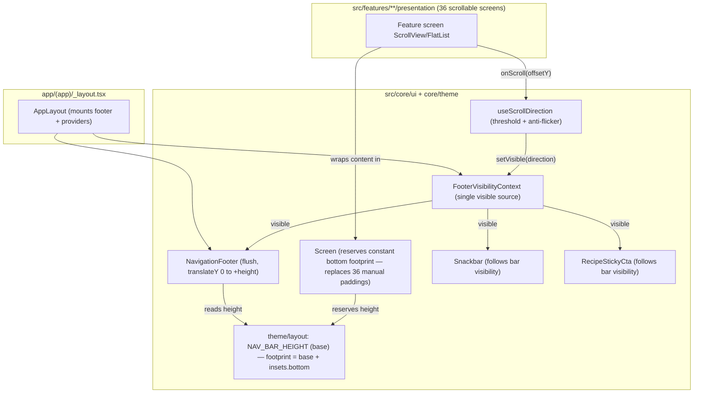

# Component diagram — footer-nav-redesign — shared scroll-direction contract

> **Feature**: mobile bottom-nav footer redesign — flush edge-to-edge bar + Revolut scroll-away.
> **Source**: audit 2026-07-15 (branch `claude/mobile-footer-audit-fef293`).
> **Related ADRs**: ADR-0029 (Proposed) — flush edge-to-edge scroll-away bar, centralized bottom clearance.
> **Decisions captured**: ADR-0029 clauses 1–5 (D1 scroll-away, D2 recover space via translate-only).

## Context

Shows the **target** structure that replaces today's floating-pill + per-screen offset. It makes explicit the single new seam — a shared scroll-direction contract feeding one footer-visibility source — and the fact that the bottom clearance moves **out of the 36 screens** into the `Screen` primitive. It does NOT show the runtime timing (see `03-sequence`) nor the visibility lifecycle (see `02-state`).

Today's coupling this removes: 36 screens (plus the app-level Snackbar — 37 consumers in total) each call `useNavigationFooterOffset()` and wire their own `paddingBottom` (audit findings M1/M2); much of the `sticky-cta-clearance` provider exists to work around the floating pill's offset arithmetic.

## Diagram

## Notes

- **Single source of truth for the bar height** (`NAV_BAR_HEIGHT` in `theme/layout` = base visual height; effective footprint = `NAV_BAR_HEIGHT + insets.bottom`, computed at runtime): both `Screen` (reserved clearance) and `NavigationFooter` (translate distance) derive from the same pair. Kills audit finding **M2** (offset was a hand-rebuilt magic number `48 + spacing.md`) and **M3** (the hardcoded `+96` in `RecipeDetailsScreen`). A bare constant alone would break on devices with a non-zero bottom safe-area inset (ADR-0029 clause 4).
- **`Screen` owns the bottom clearance** now (it already owns the top clearance via `brandHeader.contentClearance`) — removes the 36-screen opt-in that is the root cause of "it hides buttons" (**M1/B1**). `useNavigationFooterOffset` is deleted.
- **D2 (recover space when hidden)** is realized via **B1 (translate-only)**: the reserved bottom padding stays **constant**; the full-screen feel comes from the bar sliding off-screen, not from re-laying-out content. B2 (animate padding to 0 to reclaim the end-of-list gap) is **rejected** — ADR-0029, second matrix (jank + dynamic offset risk).
- **Custom bar kept** (native expo-router `Tabs` bar has no scroll-away) — settled by ADR-0029 clause 9; M4 unification stays out of scope.
- **Follow-up**: `sticky-cta-clearance` provider shrinks to just the visibility-follow concern once the floating pill is gone.
