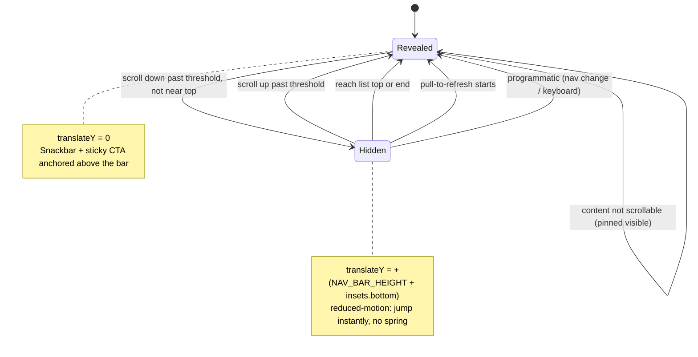

# State diagram — footer-nav-redesign — footer visibility lifecycle

> **Feature**: mobile bottom-nav footer redesign — flush edge-to-edge bar + Revolut scroll-away.
> **Related ADRs**: ADR-0029 (Proposed) — this machine realizes clauses 2–3 and 6–8.
> **Decisions captured**: D1 (scroll-away), D2 (recover space when hidden — B1 translate-only).

## Context

The `stm` for the shared footer visibility held in `FooterVisibilityContext`. It drives the bar's `translateY` (and the Snackbar / sticky-CTA follow). It deliberately models **visibility only**: the content clearance has no state dimension here — it is **constant across both states** and owned by the `Screen` primitive. That absence is the point, and it is exactly what makes the clause-6 invariant below hold.

Two states only. `Revealed` = bar flush at the bottom (`translateY = 0`). `Hidden` = bar slid off the bottom edge (`translateY = +footprint`, where footprint = `NAV_BAR_HEIGHT + insets.bottom` — ADR-0029 clause 4).

## Diagram

## Notes

- **Invariant (the fix for "it hides buttons")**: the ScrollView's bottom content padding is a **constant** bar footprint (`NAV_BAR_HEIGHT + insets.bottom`) in BOTH states. Hiding only translates the bar; it never reflows content. So whenever the user stops and the bar is `Revealed`, the last control always clears it. Correctness does not depend on the animation.
- **Anti-flicker `threshold`** (audit open point): small scrolls do not toggle — only a sustained delta past a px threshold flips the state. Prevents jitter on micro-scrolls / bounce.
- **`prefers-reduced-motion`**: the Revealed↔Hidden transition is applied **instantly** (no spring) when reduced motion is on. Same states, no animation.
- **Guard "not near top"**: near the top of a list the bar stays `Revealed` even on a down-flick, so short lists never hide the nav.
- **D2 nuance**: "recover space when hidden" is honoured by the `Hidden` translate (full-screen feel mid-scroll). The residual bar-footprint gap is only visible at the absolute list end. Reclaiming it (B2) would make the padding state-dependent — **rejected** per ADR-0029 (second matrix: jank + dynamic-offset bug surface).
