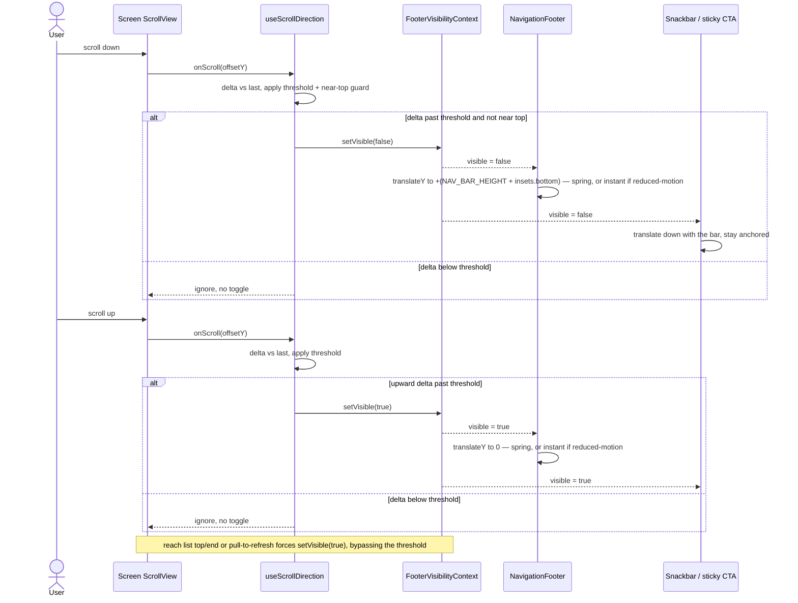

# Sequence diagram — footer-nav-redesign — scroll hide/reveal

> **Feature**: mobile bottom-nav footer redesign — flush edge-to-edge bar + Revolut scroll-away.
> **Related ADRs**: ADR-0029 (Proposed) — this scenario realizes clauses 2, 5 and 6.
> **Decisions captured**: D1 (scroll-away), D2 (recover space when hidden — B1 translate-only).

## Context

`sd` for the critical scenario: a user scrolls a feature screen, the footer hides, then reveals. Shows how one scroll handler feeds the shared visibility source and how the bar, Snackbar and sticky CTA all follow a single boolean — so they can never desync (audit finding: today the Snackbar/CTA anchor off a per-screen offset and must be hand-kept-in-sync). Realizes the `02-state` machine.

## Diagram

## Notes

- **Single boolean, no desync**: the bar, Snackbar and sticky CTA all subscribe to `FooterVisibilityContext.visible`. There is no per-screen offset in this path — the reserved clearance is static in `Screen` and untouched by scroll.
- **Threshold lives in `useScrollDirection`**, once, not per screen — the anti-flicker rule is defined in one place and every screen inherits it by wiring `onScroll`.
- **The threshold gates BOTH directions symmetrically** (hide *and* reveal): an un-gated reveal would re-introduce the flicker the threshold exists to prevent, since a hidden bar would pop back on the tiniest upward jitter or bounce. The only reveals that bypass it are the **forced** ones (list top/end, pull-to-refresh, programmatic) — they are state changes, not scroll deltas. Matches `02-state` (`scroll up past threshold` vs the separate forced-reveal transitions).
- **Wiring cost**: each of the 41 scrollable screens must pass its scroll handler to `useScrollDirection` (one line + the shared `onScroll`). This is the real migration surface — enumerate and track it in the build PR.
- **Non-scrollable screens** never call `onScroll`, so `visible` stays `true` (bar pinned) — matches the `02-state` self-loop.
- **Screens that carry a sticky CTA** (today: recipe details, brew-prep, batch details) use the same path: the CTA follows `visible`, so it slides with the bar instead of floating.
