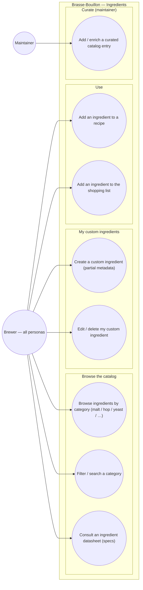

# Use-case diagram — ingredients — catalog & custom ingredients

> **Feature**: ingredient library (E05, read paths shipped); catalog expansion +
> custom user ingredients Strategy B #915; ingredient CRUD/personalisation #624.
> **Personas**: all (browse specs); Claire / Marc (author custom/exotic ingredients).

## Context

Who interacts with the ingredient library and to do what. Two parallel needs
(#915): the **curated catalog** (read-only reference, datasheet specs) and
**user-created custom ingredients** (partial metadata, BeerSmith/Brewfather
pattern) so a brewer can author a recipe even when an exotic ingredient isn't in
the catalog. A Maintainer grows the curated catalog (separate goal). Grouped by
domain; Mobile/API split is in the component view.

## Diagram

## Notes

- **Status**: UC1–UC3 (browse/filter/datasheet) are shipped (E05, read-only).
  UC4–UC5 (custom ingredients, Strategy B) are the open #915/#624 target this
  models. UC6 hands off to the recipes domain (RecipeIngredientRef). UC7 hands
  off to the shop/shopping-list feature.
- **Custom vs curated** (UC4): a custom ingredient is private to its owner
  (`isCustom` + `ownerId`) with possibly-partial specs; it never appears in
  another user's catalog unless a Maintainer promotes it (UC8).
- **Maintainer (UC8)** grows the curated catalog from references (BrewDog DIY
  Dog, canonical BeerXML fixtures) — an admin/curation goal, distinct from the
  brewer's authoring.
- **Categories** today: malt / hop / yeast (mobile); the API also has
  fermentable / water / misc / style / equipment catalogs (component/class view).
