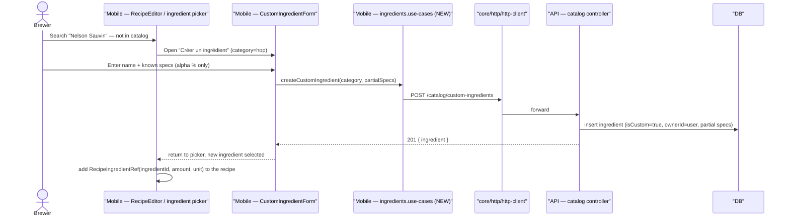

# Sequence diagram — ingredients — create a custom ingredient & use it

> **Feature**: custom ingredients Strategy B #915 / #624.
> **Source**: mobile `features/ingredients` + API `catalog` module.

## Context

The Strategy-B flow: a brewer authoring a recipe hits a missing exotic
ingredient, creates a custom one with partial metadata, and references it
immediately. This is the open #915/#624 path; browsing/filtering the curated
catalog already works and is not repeated.

## Diagram

## Notes

- **Egress**: screen → use-case → `core/http/http-client`; no direct `fetch`.
- **Partial metadata**: the form requires only `name` + `category`; specs are
  optional so the brewer is never blocked. Missing specs degrade gracefully
  (recipe calculators use defaults / flag low-confidence).
- **Scoping**: the created ingredient is private (`ownerId`); it appears only in
  the owner's picker/catalog, never in others' — until a Maintainer promotes it.
- **Demo mode**: use-cases mutate the in-memory custom-ingredient list (existing
  data-source toggle).
