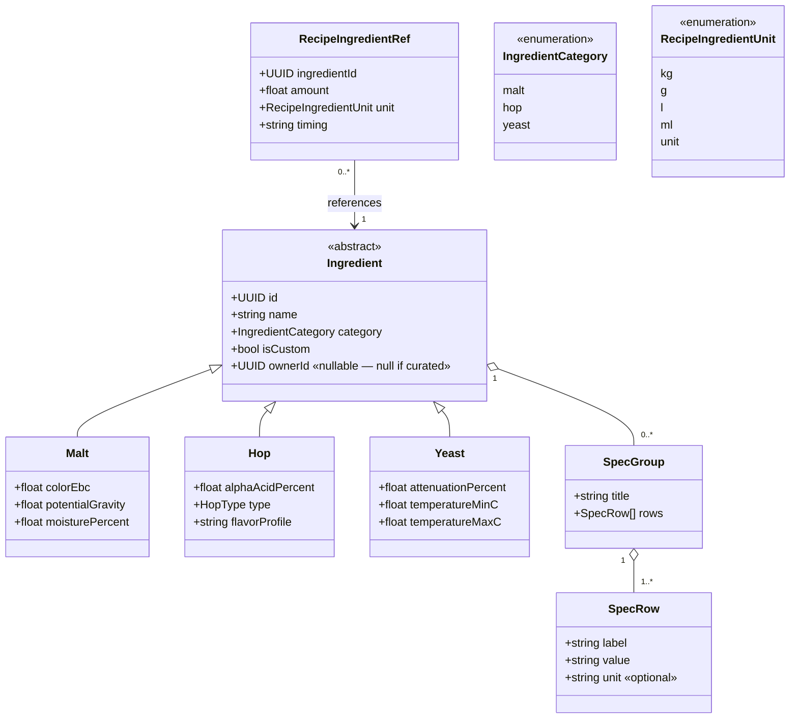

# Class diagram — ingredients — catalog model & custom ingredients

> **Feature**: ingredient library E05; custom ingredients Strategy B #915 #624.
> **Source**: `packages/mobile-app/src/features/ingredients/domain/*` and
> `packages/api/src/catalog/*`.

## Context

The ingredient model: a category-discriminated hierarchy with datasheet specs,
the `isCustom`/`ownerId` extension for user-created ingredients (Strategy B), and
how a recipe references an ingredient. Reflects the existing mobile types and the
API catalog shape; the `isCustom`/`ownerId` columns are the #915 addition (flag
before migration).

## Diagram

## Notes

- **`isCustom` + `ownerId`** (Strategy B, #915): a curated catalog entry has
  `isCustom = false`, `ownerId = null`; a user-created one is `isCustom = true`,
  scoped to its owner. Custom entries allow **partial** specs (SpecGroups may be
  sparse) so a recipe can reference an exotic ingredient not yet curated.
- **Datasheet** = `SpecGroup`/`SpecRow` (the mobile spec-group structure), e.g.
  Malt → "Color 6 EBC", "Extract 80%". Curated entries are rich; custom ones may
  have just a name + the one or two specs the brewer knows.
- **API catalog** has more categories than the mobile union (fermentable / water
  / misc / style / equipment / producer / distributor) — those are read-only
  reference tables (intentionally parallel, see the repo's CPD exclusions). The
  mobile union (malt/hop/yeast) is the user-facing subset; extend as needed.
- **Recipe link**: `RecipeIngredientRef.ingredientId` points at either a curated
  or a custom ingredient — uniform reference, so the recipe editor treats both
  identically.
