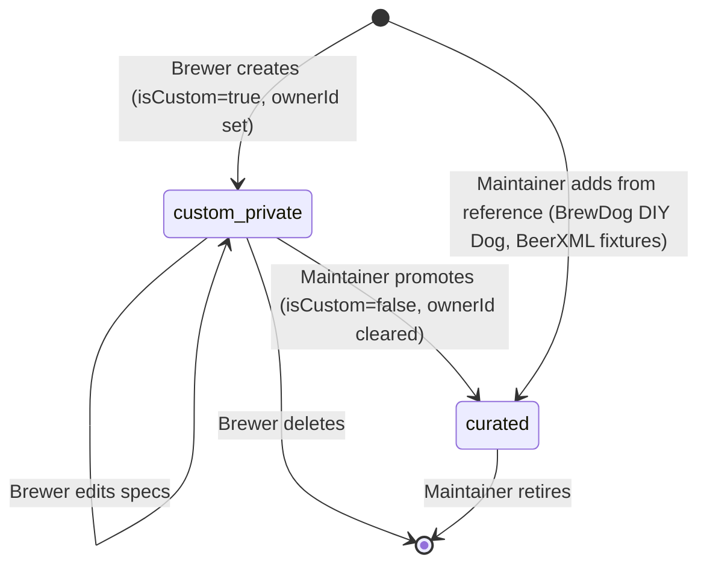

# State diagram — ingredients — provenance & promotion

> **Feature**: custom ingredients Strategy B #915.

## Context

An ingredient's provenance lifecycle: a user-created custom entry can stay
private, or be promoted by a Maintainer into the curated catalog. Curated entries
are stable reference data. This guards against custom entries leaking into other
users' catalogs and documents the (optional) promotion path.

## Diagram

## Notes

- **Promotion is maintainer-only** and one-way: a private custom ingredient
  becomes shared reference data (`isCustom=false`); the reverse (un-curate) is a
  retire, not a downgrade to someone's private entry.
- **Delete safety**: deleting a custom ingredient that a recipe already
  references is a product decision (block, or keep a denormalized snapshot on the
  RecipeIngredientRef) — flag for the #624 CRUD epic.
- **No approval queue in v0.1**: promotion is a manual maintainer action; a
  community-suggestion workflow (like the scan BeerDataSuggestion) is out of scope
  here.
