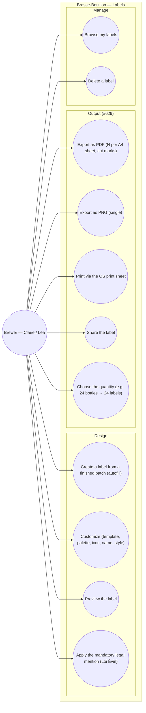

# Use-case diagram — labels — design, comply & export

> **Feature**: label designer (shipped to draft); export PDF/Print/Share #629.
> **Journey**: journey 4 "bottle & taste" (ux-refonte flags it as buried today).
> **Personas**: Claire (custom labelled creations), Léa (proud first bottle).

## Context

Who designs a bottle label and to do what, from autofilled draft to a printable
sheet. Today the flow stops at the draft detail (only Modify/Delete); #629 adds
the export/print/share that completes the journey. Grouped by domain. Compliance
(Loi Évin mention) is a constraint surfaced as a use case ("apply the legal
mention"), not an afterthought.

## Diagram

## Notes / suggestions

- **Status**: UC1–UC3 + UC10/UC11 are shipped (design to draft + text-only share);
  **UC5–UC9 (#629)** are the open export pipeline. UC4 is partly shipped (the
  `DEFAULT_LABEL_LEGAL_HINT` constant exists).
- **UC1 autofill** pulls name/style/ABV/volume/brewer/brew-date from the batch +
  recipe — the entry point should be **from the finished batch** (journey 4),
  which the ux-refonte fixes (today it is buried under "Voir plus").
- **UC4 compliance (Loi Évin, art. L.3323-4)**: the sanitary mention is
  mandatory on every alcohol label. **Suggestion** — make it non-removable in the
  editor (render it always), and consider other mandatory mentions (ABV, volume,
  allergens e.g. "contient de l'orge/gluten") — currently only the health mention
  is modelled; allergens are a likely legal gap to confirm.
- **Out of scope**: bulk/varied labels per bottle, NFC/QR on label — v0.2.
