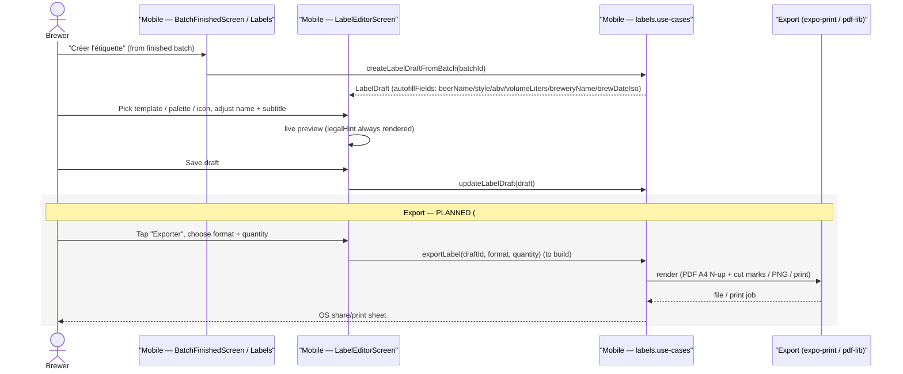

# Sequence diagram — labels — create from batch & export

> **Feature**: label designer; export pipeline #629.

## Context

The journey-4 flow: from a finished batch, create a label (autofilled), customize
it, then export/print/share (#629). Today the chain stops after save (text-only
share); this models the export pipeline to add.

## Diagram

## Notes / suggestions

- **Autofill at creation** binds the label to the batch's real data; later batch
  edits do **not** retro-change a saved label (snapshot) — confirm this is the
  desired behaviour for #629.
- **Export library**: #629 suggests `expo-print` or `pdf-lib`. **Suggestion** —
  PDF A4 packing needs correct physical dimensions per bottle format (33/44/75 cl)
  with bleed + cut marks; spec the mm dimensions before building so labels print
  to size.
- **No network needed** for export (local render) — works offline.
- **Demo mode**: autofill reads the demo batch; export still produces a real file.
