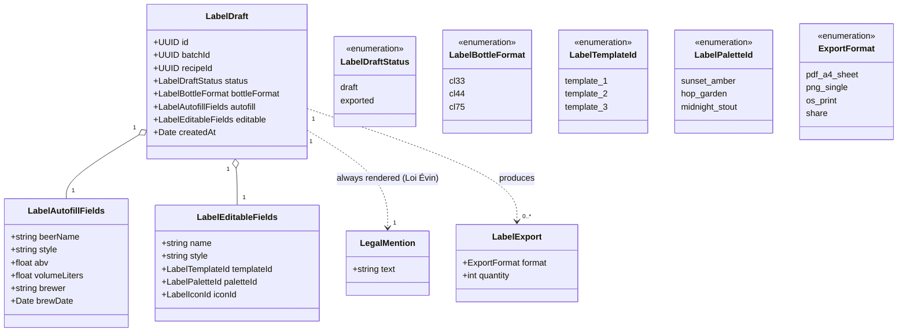

# Class diagram — labels — draft model & export

> **Feature**: label designer; export #629.
> **Source**: `features/labels/domain/label.types.ts` + `label.constants.ts`.

## Context

The label draft model as it exists, plus the export target (#629). Autofilled
fields (from batch/recipe) and editable design fields are separated, matching the
code. The mandatory legal mention is a domain constant, not an editable field.

## Diagram

## Notes / suggestions

- **Today**: `LabelDraftStatus` only has `draft`; `exported` is the #629 addition
  (so a label can show "exported"/"ready to print"). Bottle formats, templates,
  palettes, icons match the existing constants.
- **`LegalMention`** = `DEFAULT_LABEL_LEGAL_HINT` (Loi Évin) — always rendered,
  not user-editable. **Suggestion** — model additional mandatory mentions (ABV,
  net volume, allergens) as required fields rendered on every template, so
  compliance is structural not optional.
- **`LabelExport`** is transient (a render action), not necessarily persisted; the
  PDF A4 sheet packs `quantity` labels with cut marks/bleed per format (#629).
- **Autofill vs editable**: autofill is the truth from the batch; editable lets
  the brewer override display name/style + pick the visual — keep them separate so
  re-autofill never clobbers the brewer's design choices.
