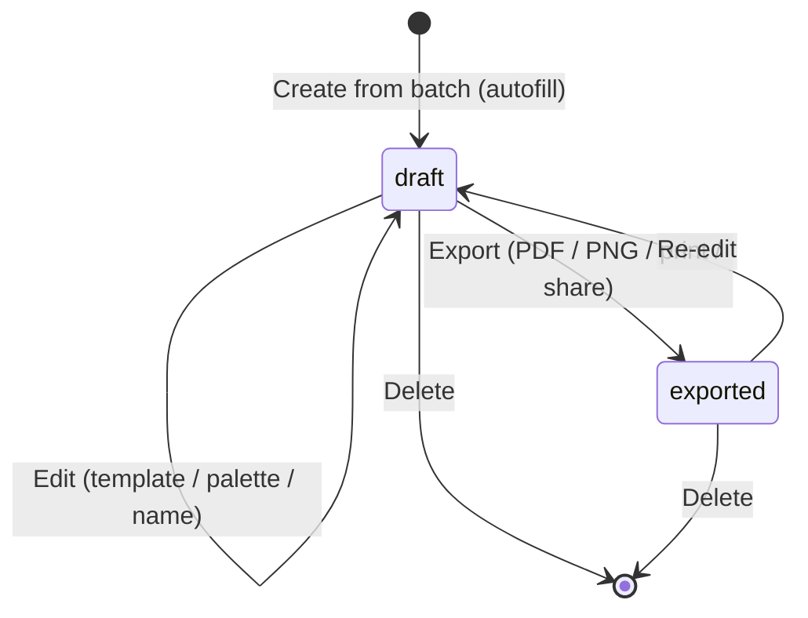

# State diagram — labels — draft lifecycle

> **Feature**: label designer; export #629.

## Context

A label's lifecycle, from creation to export. Today only `draft` exists; #629
adds the `exported` outcome so the UI can show a label as ready/printed.

## Diagram

## Notes / suggestions

- **`exported` is non-terminal**: re-editing an exported label returns it to
  `draft` (a new export supersedes the old) — keeps the model honest about
  reprints after a tweak.
- **No "published/shared-to-community" state** in scope: labels are private
  artefacts; a community label gallery (#832 creator gallery) would add a
  `published` state later — out of scope here.
- **Legal mention** is invariant across every state (always rendered) — it is not
  a state, it is a rendering rule (see class diagram).
