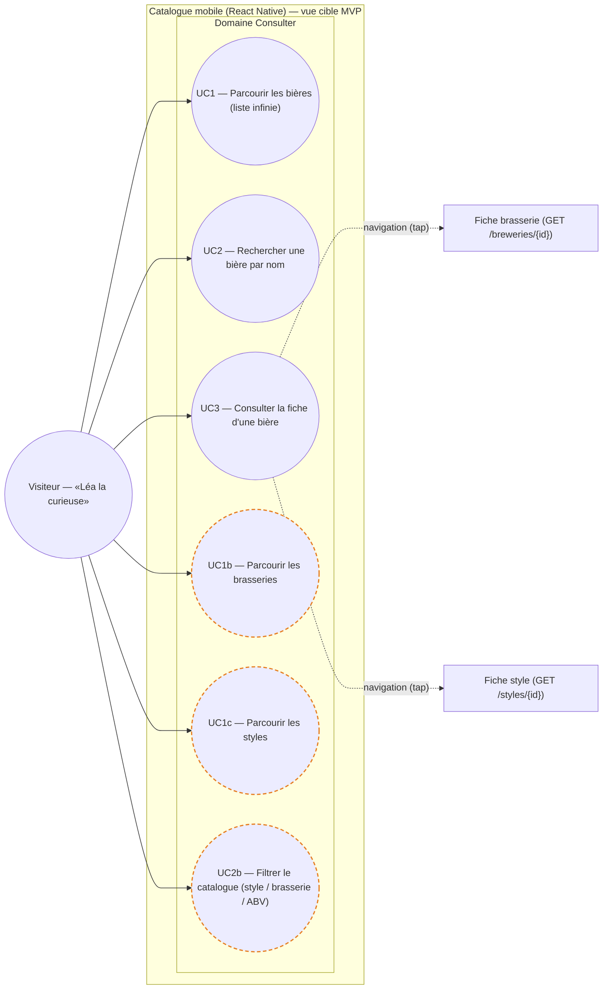
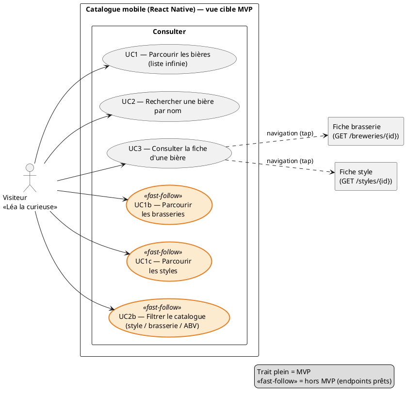

# Diagramme de cas d'usage — mobile-catalog — catalogue de bières (réalisation mobile)

> **Périmètre :** réalisation **mobile** de UC1/UC2/UC3 (catalogue de bières) — consommation de l'API encyclopédie
> **Code concerné (cible) :** `packages/mobile-app/src/features/beer-catalog/`, `packages/mobile-app/app/(app)/beer-catalog/`
> **ADR liés :** repo ADR-0005 (split backend — l'encyclopédie possède la connaissance bière), repo ADR-0013 (la conception fait foi), ADR-0017 (intervalles IBU/SRM)
> **Voir aussi :** `../beer-encyclopedia/01-use-case.md` (UC1/2/3 — vue backend) · `06-component.md` · `02-sequence-browse.md` · `03-sequence-search.md` · `04-sequence-fiche.md` · `../../traceability-matrix.md`

## Contexte

Ce diagramme **raffine côté mobile** les cas d'usage UC1/UC2/UC3 déjà définis pour
l'encyclopédie (`../beer-encyclopedia/01-use-case.md`). Le **but de l'acteur ne change pas**
avec l'appareil — c'est la **réalisation mobile** qui ajoute des extensions absentes de la
fiche backend : pagination **infinie** (scroll), recherche **debouncée/annulable**, états
**chargement / vide / erreur / hors-ligne**. Ces réalisations non triviales justifient des
diagrammes de séquence dédiés (`02`–`05`), cf. la règle révisée de la matrice de traçabilité.

**Périmètre MVP (vue cible)** : **bières** — Parcourir, Rechercher, Consulter la fiche. La
**fiche brasserie** et la **fiche style** sont atteintes **en tapant** depuis la fiche bière
(navigation, toujours UC3, `GET /breweries/{id}` · `GET /styles/{id}`). Le **parcours** des
rubriques brasseries/styles et les **filtres** (style, brasserie, ABV) sont des **`<<fast-follow>>`**
(endpoints déjà prêts, hors MVP) — marqués pour le contrôle de conformité conception ↔ code.

## Diagramme (Mermaid — aperçu rapide)

*Même cas d'usage en **PlantUML** (notation magistrale : acteur, ovales, stéréotypes). À garder **synchronisé** avec le bloc Mermaid.*

## Relations (récapitulatif)

- **Même acteur, même but** : la réalisation mobile de UC1/UC2/UC3 ne crée pas de nouveaux
  buts ; elle réalise les buts du Visiteur déjà modélisés côté encyclopédie.
- **Navigation (non modélisée comme relation)** : depuis la fiche bière (UC3), taper la
  brasserie ou le style **ouvre leur fiche** — c'est de la **navigation** (toujours UC3 pour
  une autre entité), pas un «include»/«extend».
- **`<<fast-follow>>`** : UC1b/UC1c (parcours brasseries/styles) et UC2b (filtres) sont des
  **sous-buts** de UC1/UC2 différés au MVP+1 ; les endpoints (`GET /breweries`, `GET /styles`,
  filtres de `GET /beers`) existent déjà (cf. `06-component.md`).

## Notes

- **MVP livrable** : UC1 (bières), UC2 (bières), UC3 (fiche bière + fiches brasserie/style en
  navigation). Pas de filtres, pas de rubriques brasseries/styles.
- **UML 2.5** : chaque nœud est un **but initié par le Visiteur** ; groupé **par domaine**
  (Consulter), jamais par composant — la décomposition route → écran → hook → data → API vit
  dans `06-component.md`.
- **Pagination = infinie** (scroll), décision structurante réalisée par `useInfiniteQuery`
  (`02-sequence-browse.md`, `07-state-list-screen.md`). Un seul hook sert *parcourir* ET
  *rechercher* (cf. `06-component.md`).
- **Lecture publique** : ces consultations sont **sans authentification** (`auth:false`,
  ADR-0005) — aucune PII envoyée (cf. `11-data-flow.md`).

## Spécifications des cas d'usage (Cockburn) — extensions mobiles

> Les buts, préconditions et garanties restent ceux de `../beer-encyclopedia/01-use-case.md`.
> Seules sont détaillées ici les **extensions propres à la réalisation mobile** (états d'écran).

### UC1 — Parcourir les bières (réalisation mobile) — *cible MVP*

- **Acteur principal :** Visiteur · **Garantie de succès :** liste **infinie** affichée, pages chargées au défilement
- **Scénario nominal**
    1. Le Visiteur ouvre l'écran catalogue.
    2. Le système charge la 1ʳᵉ page (`GET /beers?page=1&per_page=20`) et affiche la liste.
    3. En approchant du bas, le système charge la page suivante et l'ajoute à la liste.
- **Extensions (mobiles)**
  - 2a. Chargement initial → **squelette / indicateur**.
  - 2b. Rubrique vide (aucune bière) → message « aucune bière » + invite au scan (UC4).
  - 2c. Erreur réseau au chargement initial → écran d'erreur + **« Réessayer »**.
  - 3a. Dernière page atteinte (`page × per_page ≥ total`) → arrêt du chargement (pas de pied de liste).
  - 3b. Erreur au chargement de la page suivante → **erreur en pied de liste** (la liste déjà chargée reste visible) + réessai en place.
  - \*a. Hors-ligne **avec cache** → liste servie depuis le cache (staleTime) + bannière hors-ligne.
- **Postcondition :** aucune modification. · **Relations :** association Visiteur seule.

### UC2 — Rechercher une bière par nom (réalisation mobile) — *cible MVP*

- **Acteur principal :** Visiteur · **Garantie de succès :** résultats paginés, pertinents au terme saisi
- **Scénario nominal**
    1. Le Visiteur saisit un terme.
    2. Après **debounce (≈300 ms)**, le système interroge `GET /beers/search?q=&page=1`.
    3. Le système affiche les résultats (mêmes pages infinies que UC1) ; ouvrir un résultat → UC3.
- **Extensions (mobiles)**
  - 1a. Terme **trop court** (< 2 caractères) → **aucun appel**, invite à préciser.
  - 1b. Nouvelle frappe avant réponse → la requête précédente est **annulée** (changement de clé de cache).
  - 2a. Aucun résultat → message « aucune bière pour « \<terme\> » » + orientation (UC1 / scan UC4).
  - 2b. Erreur réseau → écran d'erreur + « Réessayer ».
- **Postcondition :** aucune modification. · **Relations :** association Visiteur seule (recherche sur le **nom de bière**).

### UC3 — Consulter la fiche d'une bière (réalisation mobile) — *cible MVP*

- **Acteur principal :** Visiteur · **Précondition :** un identifiant de bière est fourni (éventuellement **obsolète/invalide** — voir extension 1a) · **Garantie de succès :** fiche détaillée affichée
- **Scénario nominal**
    1. Le Visiteur ouvre une fiche (depuis UC1, UC2, ou l'identification UC4).
    2. Le système affiche `GET /beers/{id}` : nom, brasserie, style, ABV, intervalles IBU/SRM (→ EBC d'affichage), description, mentions légales, provenance.
- **Extensions (mobiles)**
  - 1a. Bière introuvable → message « bière introuvable » (404).
  - 2a. **Tap brasserie** → ouvre la fiche brasserie (`GET /breweries/{id}`) — navigation.
  - 2b. **Tap style** → ouvre la fiche style (`GET /styles/{id}`) — navigation.
  - \*a. Hors-ligne **sans cache** → écran d'erreur + « Réessayer ».
- **Postcondition :** aucune modification. · **Relations :** point d'arrivée de UC1/UC2 ; inclus par UC4 (scan).
