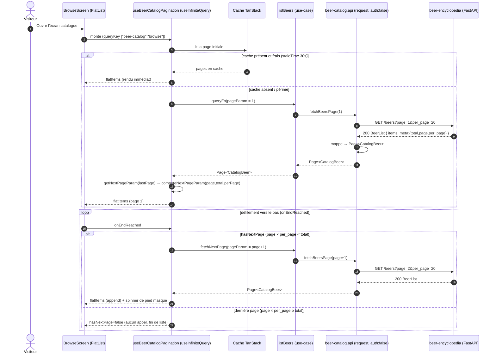
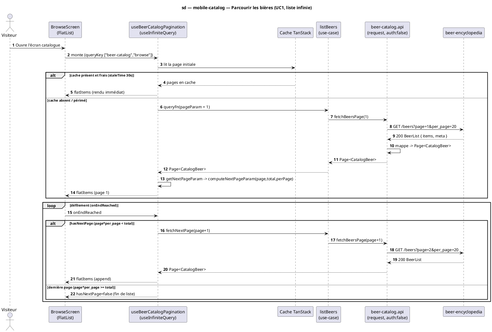

# Diagramme de séquence — mobile-catalog — Parcourir les bières (UC1, liste infinie)

> **Réalise :** UC1 — Parcourir les bières, **côté mobile** (chargement initial + page suivante + cache)
> **Code concerné (cible) :** `features/beer-catalog/presentation/BeerCatalogBrowseScreen.tsx`, `application/useBeerCatalogPagination.ts`, `application/computeNextPageParam.ts`, `data/beer-catalog.api.ts`
> **ADR liés :** repo ADR-0005 (lecture publique chez Python), ADR-0017 (intervalles), repo ADR-0013 (la conception fait foi)
> **Voir aussi :** `01-use-case.md` (UC1) · `06-component.md` · `09-class-domain.md` (`Page<T>`, `PaginationMeta`) · `07-state-list-screen.md` · `03-sequence-search.md` · `../../traceability-matrix.md`

## Contexte

Séquence **cible** du parcours infini des bières. Montre l'**orchestration côté client** que la
fiche Cockburn ne porte pas : vérification du **cache** TanStack, chargement de la 1ʳᵉ page,
puis **page suivante au défilement** (`onEndReached` → `fetchNextPage`), avec l'**arrêt** piloté
par `getNextPageParam` (math 1-based sur `meta`). C'est cette non-trivialité (boucle, branches
cache/fin de liste) qui justifie une séquence (règle révisée, matrice de traçabilité).

## Diagramme (Mermaid — flux cible)

*Même flux en **PlantUML** (à garder synchronisé avec le bloc Mermaid).*

## Notes

- **`getNextPageParam` (1-based).** `computeNextPageParam(page, total, perPage)` :
  `page × perPage < total ⇒ page + 1`, sinon `undefined` (⇒ `hasNextPage = false`, la boucle
  s'arrête). Fonction **pure, testée** isolément (cas : page unique, dernière page exacte,
  `total = 0`). C'est `meta.total` qui borne la pagination — pas de lien `next`/`prev` côté API.
- **Dé-doublonnage des appels.** TanStack ne lance qu'**une requête par `pageParam`** ;
  plusieurs `onEndReached` rapprochés ne déclenchent pas d'appels concurrents pour la même page.
- **Cache.** `queryKey ["beer-catalog","browse"]`, `staleTime 30s`, `gcTime 5min`, `retry 1`
  (`core/query`). Au remontage avant péremption, la liste s'affiche **sans réseau** (branche
  haute). Erreurs/hors-ligne : voir `05-sequence-errors.md`. Cycle de vie d'écran : `07`.
- **Noms dénormalisés.** `GET /beers` renvoie `brewery_name`/`style_name` **null** aujourd'hui
  (résolus seulement sur `import-by-ean`, cf. `09` + `../beer-encyclopedia/07-class-api-contract.md`) ;
  la carte affiche un libellé de repli en attendant leur résolution côté API (divergence à suivre).
- **Conformité.** Le code (`useBeerCatalogPagination` + `beer-catalog.api`) doit se conformer à
  cette séquence : `useInfiniteQuery`, `initialPageParam = 1`, `getNextPageParam =
  computeNextPageParam`. Implémentation après validation.
