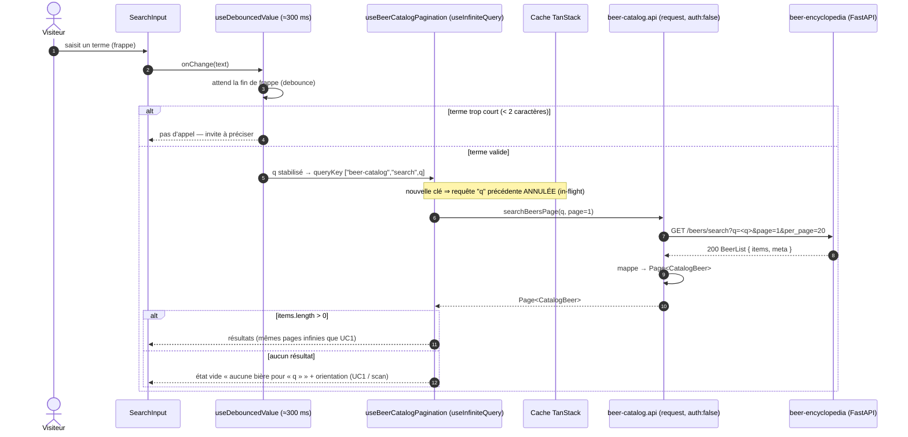
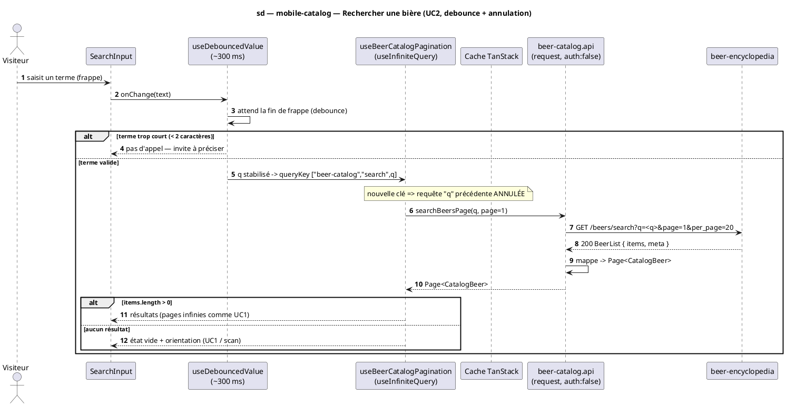

# Diagramme de séquence — mobile-catalog — Rechercher une bière (UC2, debounce + annulation)

> **Réalise :** UC2 — Rechercher une bière par nom, **côté mobile** (debounce → annulation in-flight → résultats / vide)
> **Code concerné (cible) :** `features/beer-catalog/presentation/BeerCatalogSearchScreen.tsx`, `application/useDebouncedValue.ts`, `application/useBeerCatalogPagination.ts`, `data/beer-catalog.api.ts`
> **ADR liés :** repo ADR-0005 (lecture publique), repo ADR-0013 (la conception fait foi)
> **Voir aussi :** `01-use-case.md` (UC2) · `08-state-search-input.md` (FSM saisie) · `02-sequence-browse.md` (même hook paginé) · `06-component.md` · `../../traceability-matrix.md`

## Contexte

Séquence **cible** de la recherche. Réutilise le **même hook paginé** que le parcours
(`02-sequence-browse.md`) ; seuls la **clé de cache** et l'endpoint changent. La non-trivialité
propre à la recherche : **debounce** (≈300 ms) pour ne pas appeler à chaque frappe, et
**annulation de la requête en vol** quand l'utilisateur tape de nouveau (changement de
`queryKey` → TanStack abandonne la requête `q` périmée). La FSM de la saisie est détaillée dans
`08-state-search-input.md`.

## Diagramme (Mermaid — flux cible)

*Même flux en **PlantUML** (à garder synchronisé avec le bloc Mermaid).*

## Notes

- **Debounce.** Le terme n'est propagé au hook qu'après stabilisation (`useDebouncedValue`,
  ≈300 ms) → une frappe rapide « ip…pa » ne lance pas 4 requêtes. Le debounce vit au
  **composant/hook**, pas dans la requête.
- **Annulation in-flight.** Le changement de `queryKey` (`q` → `q'`) fait que TanStack
  **abandonne** la requête en vol pour `q` ; seule la dernière `q` se résout. Pas d'annulation
  manuelle (`AbortController`) à écrire — c'est la clé qui pilote. `placeholderData:
  keepPreviousData` garde les résultats précédents affichés pendant la nouvelle requête (pas de
  flash vide).
- **Garde API.** `q` est requis côté API (`min 1, max 100`) → un `q` vide renverrait 422 ; la
  garde « < 2 caractères » côté mobile évite l'appel inutile (et le 422).
- **Même pagination.** Les résultats se paginent comme UC1 (`onEndReached` → page suivante de
  `/beers/search`). Voir `02-sequence-browse.md` pour la boucle et `getNextPageParam`.
- **Conformité.** Le code doit réutiliser `useBeerCatalogPagination` en mode recherche
  (queryKey + endpoint), avec `useDebouncedValue` et `keepPreviousData`. Implémentation après
  validation.
