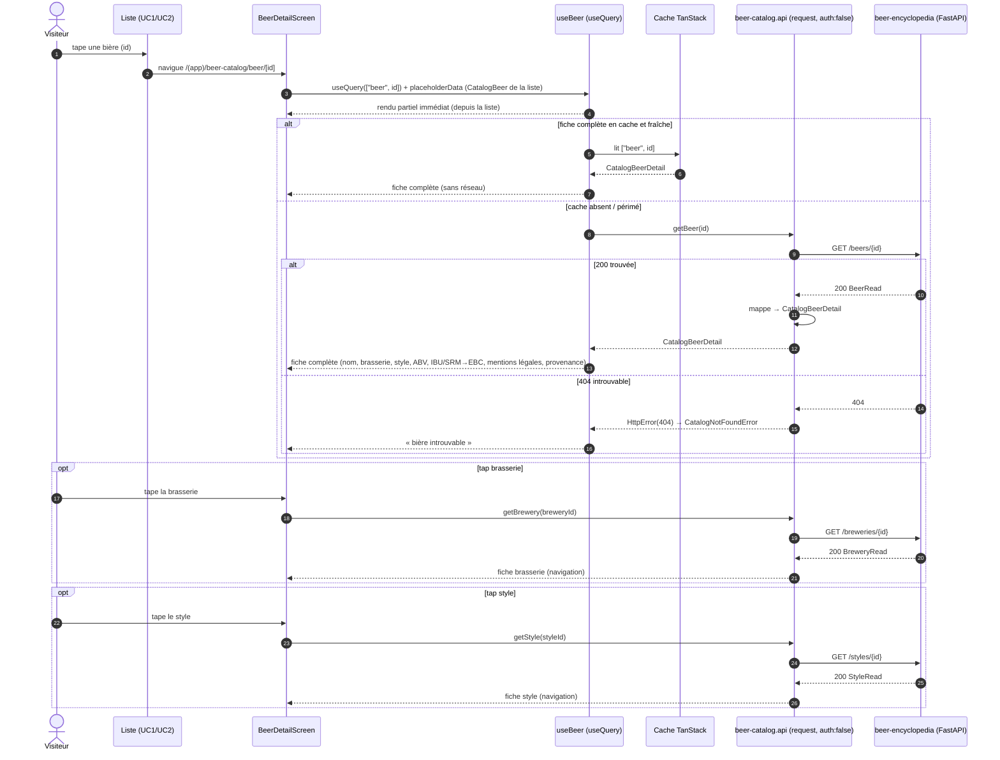
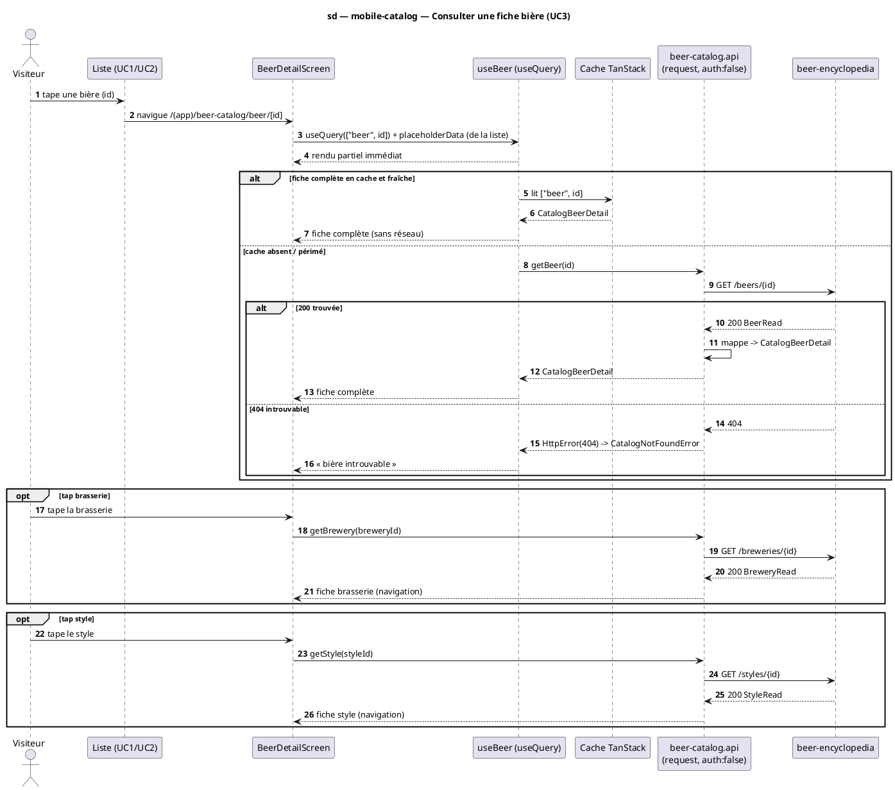

# Diagramme de séquence — mobile-catalog — Consulter une fiche bière (UC3, + tap brasserie/style)

> **Réalise :** UC3 — Consulter la fiche d'une bière, **côté mobile** (GET by id + amorçage cache + navigation brasserie/style)
> **Code concerné (cible) :** `features/beer-catalog/presentation/BeerDetailScreen.tsx`, `application/useBeer.ts`, `data/beer-catalog.api.ts`
> **ADR liés :** repo ADR-0005 (lecture publique), ADR-0017 (intervalles → EBC d'affichage), repo ADR-0013 (la conception fait foi)
> **Voir aussi :** `01-use-case.md` (UC3) · `09-class-domain.md` (`CatalogBeerDetail`) · `10-class-view-model.md` (`BeerDetailVM`) · `05-sequence-errors.md` (404) · `../../traceability-matrix.md`

## Contexte

Séquence **cible** de la fiche bière. Montre l'**amorçage du cache** (la ligne de liste porte
déjà un `CatalogBeer` → la fiche s'affiche partiellement **avant** la réponse `GET /beers/{id}`),
la branche **404**, et la **navigation** vers la fiche brasserie/style (tap → `GET /breweries/{id}`
/ `GET /styles/{id}`). C'est une lecture simple **par entité**, mais les branches (cache /
404 / navigation) la rendent non triviale côté client.

## Diagramme (Mermaid — flux cible)

*Même flux en **PlantUML** (à garder synchronisé avec le bloc Mermaid).*

## Notes

- **Amorçage du cache (liste → détail).** La ligne de liste porte déjà un `CatalogBeer` ;
  `useQuery(["beer", id])` reçoit ce `CatalogBeer` en `placeholderData` (ou `initialData`) →
  la fiche s'affiche **immédiatement** (titre, brasserie, style, ABV) pendant que `GET
  /beers/{id}` complète les champs lourds (`CatalogBeerDetail` : mentions légales, provenance).
- **404.** `HttpError(404)` (de `core/http`) → `CatalogNotFoundError` → message « bière
  introuvable ». Les autres erreurs (timeout / hors-ligne) : `05-sequence-errors.md`. Le
  catalogue est **encyclopédie-seule** (pas de secours NestJS, contrairement au scan UC4).
- **Navigation brasserie/style.** Tap → `getBrewery`/`getStyle` (clés `["brewery", id]` /
  `["style", id]`). C'est de la **navigation** (UC3 pour une autre entité), pas un «include».
  Les routes sont portées par `TapTargetVM` (`10-class-view-model.md`).
- **Affichage couleur.** SRM (bornes) → EBC d'affichage via `srmToEbc`/`ebcToHex` réutilisés du
  **scan** ; calcul au **view-model** (`10`), pas au domaine. Cf. `11-data-flow.md`.
- **Conformité.** `useBeer` = `useQuery` (pas `useInfiniteQuery`) ; `getBeer`/`getBrewery`/
  `getStyle` via `request()` `auth:false`. Implémentation après validation.
