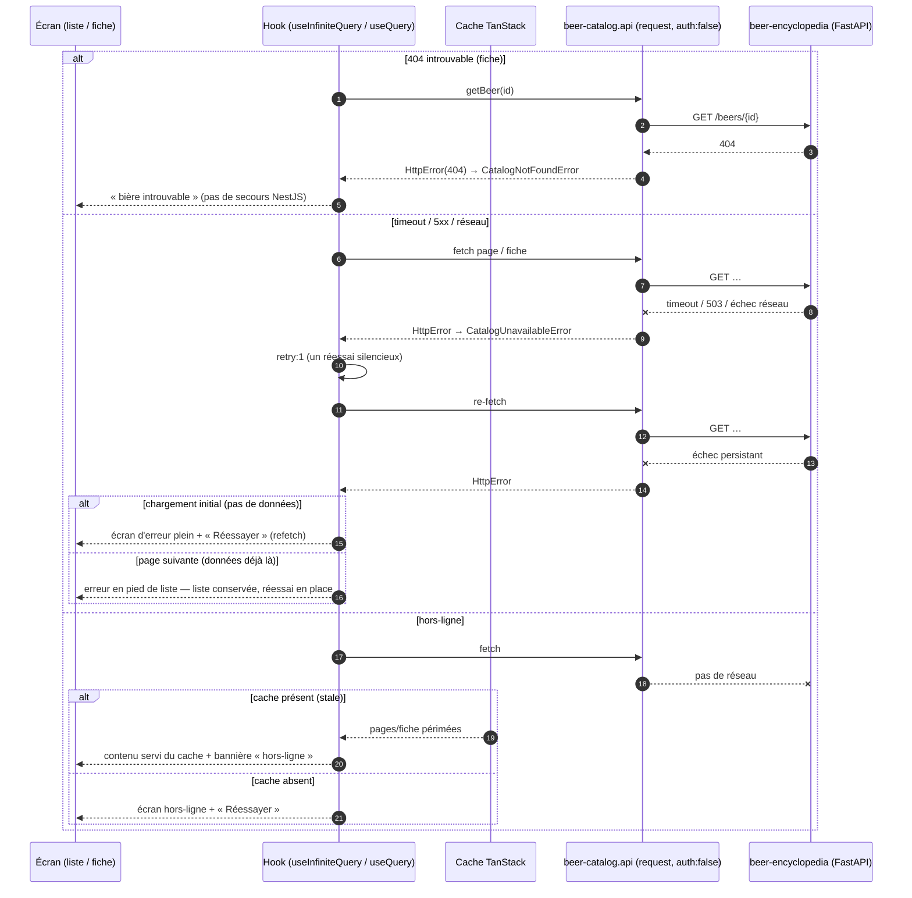
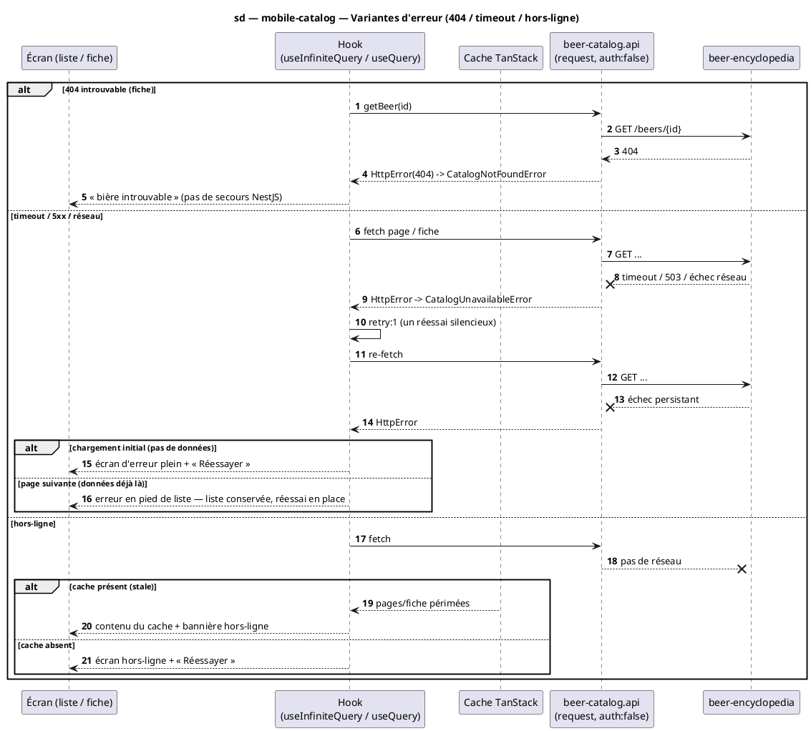

# Diagramme de séquence — mobile-catalog — Variantes d'erreur (404 / timeout / hors-ligne)

> **Réalise :** branches d'erreur **transverses** de UC1/UC2/UC3 (réalisation mobile)
> **Code concerné (cible) :** `features/beer-catalog/data/beer-catalog.api.ts`, `application/*`, `core/http/http-error.ts`, `core/query/QueryClient`
> **ADR liés :** repo ADR-0005 (encyclopédie-seule, pas de secours NestJS), repo ADR-0013 (la conception fait foi)
> **Voir aussi :** `02-sequence-browse.md` · `03-sequence-search.md` · `04-sequence-fiche.md` · `07-state-list-screen.md` (états error/offline) · `../../traceability-matrix.md`

## Contexte

Séquence **transverse** des cas d'erreur, factorisée pour les trois chemins heureux (`02`–`04`).
Trois variantes : **404** (introuvable), **timeout / 5xx / réseau** (avec le `retry:1` de
TanStack), **hors-ligne** (cache périmé servi vs erreur). Distingue l'erreur **au chargement
initial** (plein écran) de l'erreur **de page suivante** (pied de liste, la liste reste
visible) — distinction reprise par `07-state-list-screen.md`.

## Diagramme (Mermaid — flux cible)

*Même flux en **PlantUML** (à garder synchronisé avec le bloc Mermaid).*

## Notes

- **Mapping d'erreurs.** `404 → CatalogNotFoundError` (« introuvable ») ;
  `503 / timeout / réseau → CatalogUnavailableError` (« service indisponible / réessayer »).
  Réutilise `HttpError(status, message, details)` de `core/http/http-error.ts`. Le `422`
  (q vide) est évité en amont par la garde de recherche (`03-sequence-search.md`).
- **`retry:1`.** Un seul réessai silencieux (config `core/query`) avant de remonter l'erreur à
  l'UI — absorbe les coupures transitoires sans boucle.
- **Initial vs page suivante.** Erreur **initiale** (aucune donnée) → écran plein + « Réessayer ».
  Erreur de **page suivante** (`isFetchingNextPage` en échec) → **pied de liste** en erreur, la
  liste déjà chargée **reste visible** (ne pas tout jeter). Repris dans `07-state-list-screen.md`
  (états `Error` vs `NextPageError`).
- **Hors-ligne.** Cache **en mémoire** uniquement (pas d'`AsyncStorage` en MVP) : « hors-ligne
  avec contenu » n'existe que si la donnée a déjà été chargée dans la session (`gcTime 5min`).
  Une vraie persistance hors-ligne est un **fast-follow** (cf. `11-data-flow.md`).
- **Encyclopédie-seule.** Aucune bascule vers NestJS sur 404 (≠ scan UC4 transitoire) : le
  catalogue lit uniquement Python (ADR-0005).
- **Conformité.** Le code doit produire ces mappings d'erreur et distinguer initial/page
  suivante. Implémentation après validation.
