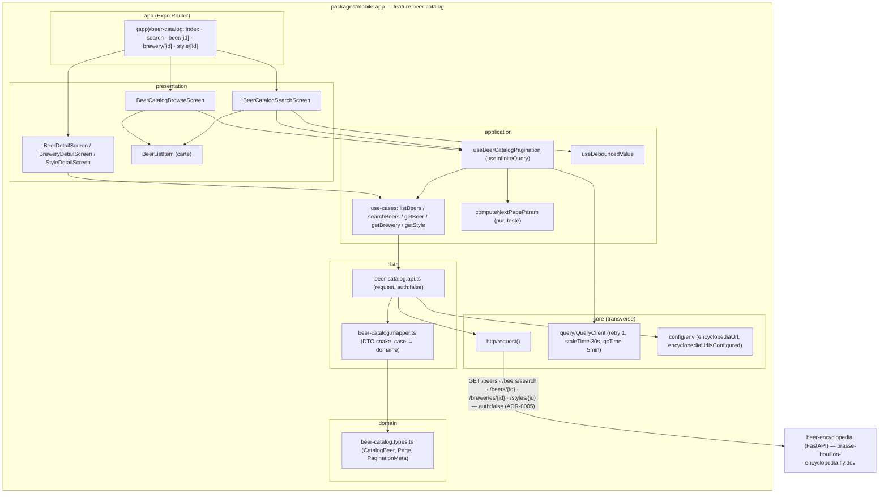
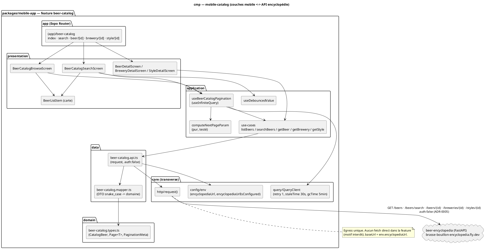

# Diagramme de composant — mobile-catalog — couches mobile ↔ API encyclopédie

> **Périmètre :** structure interne de la feature `beer-catalog` (mobile) + frontière vers l'API encyclopédie
> **Code concerné (cible) :** `packages/mobile-app/src/features/beer-catalog/{domain,data,application,presentation}/`, `packages/mobile-app/app/(app)/beer-catalog/`, `packages/mobile-app/src/core/{http,query,config}/`
> **ADR liés :** repo ADR-0005 (split backend — le mobile lit les faits bière chez Python), repo ADR-0013 (la conception fait foi)
> **Voir aussi :** `01-use-case.md` · `09-class-domain.md` · `02-sequence-browse.md` · `../beer-encyclopedia/03-component.md` (vue backend) · `../../traceability-matrix.md`

## Contexte

Décomposition structurelle de la feature mobile `beer-catalog` (couches Clean :
`app` → `presentation` → `application` → `data` → `core/http`) et **frontière ADR-0005**
avec le service Python. Répond à « comment c'est structuré », pas « qui veut quoi »
(ça, c'est `01-use-case.md`).

**Points que ce diagramme rend explicites** : (1) l'**egress unique** est
`core/http/request()` — aucun `fetch` direct dans la feature (motif interdit projet) ;
(2) les lectures catalogue sont **`auth:false`** sur `baseUrl: env.encyclopediaUrl`
(l'encyclopédie est publique, ADR-0005) ; (3) **un seul hook** `useBeerCatalogPagination`
(`useInfiniteQuery`) sert *parcourir* et *rechercher* ; (4) la `presentation` n'importe
jamais `data/` en direct — elle passe par `application/`.

## Diagramme (Mermaid — aperçu rapide)

*Même structure en **PlantUML** (notation magistrale). À garder **synchronisée** avec le bloc Mermaid.*

## Notes

- **Egress unique** : seul `core/http/request()` parle au réseau ; `beer-catalog.api.ts`
  l'appelle avec `baseUrl: env.encyclopediaUrl` + `auth: false`. Aucun `fetch()` direct (motif
  interdit, CLAUDE.md). Garde `encyclopediaUrlIsConfigured` → `HttpError(503)` si l'URL n'est
  pas configurée (même garde que la feature `scan`).
- **Règle de dépendance (Clean)** : `presentation → application → data → core`. La
  `presentation` n'importe **jamais** `data/` ; `domain/` n'importe rien. La feature ne dépend
  pas de `scan` (mappers **dupliqués**, pas partagés — cibles différentes, voir `11-data-flow.md`).
- **Un seul hook paginé** : `useBeerCatalogPagination` (`useInfiniteQuery`) sert *parcourir*
  (`listBeers`) et *rechercher* (`searchBeers`) ; seule la **clé de cache** et l'endpoint
  changent (`["beer-catalog","browse"]` vs `["beer-catalog","search",q]`). `computeNextPageParam`
  est **pur et testé** isolément (math 1-based, cf. `02-sequence-browse.md`).
- **Frontière ADR-0005** : le mobile lit les **faits bière** chez Python (catalogue), et garde
  NestJS pour les **données utilisateur** (hors de ce diagramme). NestJS n'est **pas** sur le
  chemin catalogue.
- **Conformité** : le code (cible `features/beer-catalog/`) doit se conformer à cette
  structure. Implémentation **après** validation de la conception (`Part A`).
