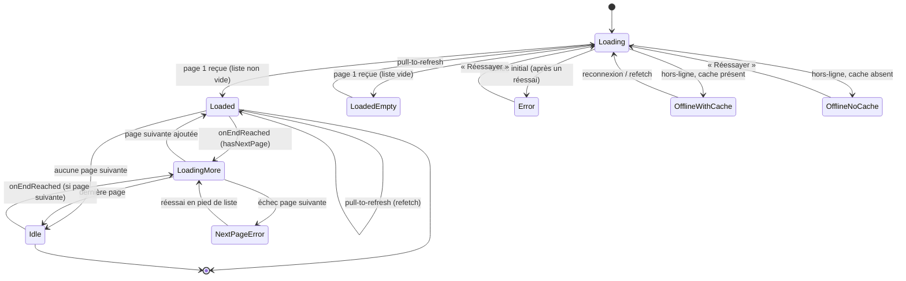
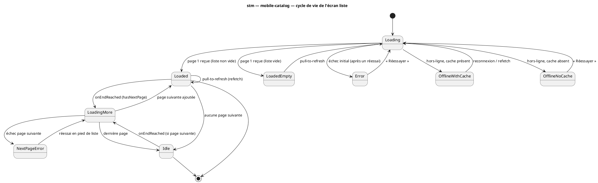

# Diagramme d'états — mobile-catalog — cycle de vie de l'écran liste

> **Périmètre :** machine à états de l'écran liste (parcourir UC1 / résultats UC2), pagination infinie
> **Code concerné (cible) :** `features/beer-catalog/presentation/BeerCatalogBrowseScreen.tsx` (+ Search), drapeaux dérivés de `useBeerCatalogPagination`
> **ADR liés :** repo ADR-0013 (la conception fait foi)
> **Voir aussi :** `02-sequence-browse.md` · `05-sequence-errors.md` · `10-class-view-model.md` (`CatalogListVM`) · `08-state-search-input.md` · `../../traceability-matrix.md`

## Contexte

Cycle de vie de l'écran liste : la **pagination infinie** crée de vrais états (on peut être
« chargé **et** en train de charger plus »). Ces états sont **dérivés** des indicateurs
TanStack (`isLoading`, `isFetchingNextPage`, `isError`, `data`, `hasNextPage`), **pas** une FSM
écrite à la main — le diagramme nomme les états pour le contrôle de conformité (ils
correspondent aux drapeaux de `CatalogListVM`, `10`).

## Diagramme (Mermaid — aperçu rapide)

*Même machine en **PlantUML** (à garder synchronisée avec le bloc Mermaid).*

## Notes

- **États dérivés (correspondance TanStack).**
  - `Loading` = `isLoading` (aucune donnée encore) ;
  - `Loaded` = `data` présent, items > 0, pas de fetch de page en cours ;
  - `LoadingMore` = `isFetchingNextPage` ;
  - `Error` = `isError && !data` (échec initial) ;
  - `NextPageError` = `isError && data` (échec de page suivante, liste conservée) ;
  - `LoadedEmpty` = `!isLoading && flatItems.length === 0` ;
  - `Idle` = chargé sans page suivante (`hasNextPage === false`).
  - `hasNextPage` **garde** la transition `onEndReached`.
- **`Error` vs `NextPageError`.** Distinction structurante (cf. `05-sequence-errors.md`) :
  échec **initial** → écran d'erreur plein ; échec de **page suivante** → erreur **en pied de
  liste**, la liste déjà chargée reste affichée.
- **Hors-ligne.** `OfflineWithCache` sert le contenu périmé + bannière ; `OfflineNoCache` →
  écran hors-ligne. Cache **en mémoire** (`gcTime 5min`) — persistance hors-ligne = fast-follow.
- **Recherche.** Le même écran liste sert les résultats de recherche ; la saisie a sa propre
  FSM (`08-state-search-input.md`), qui **alimente** ce cycle de vie une fois la requête lancée.
- **Conformité.** Les drapeaux de `CatalogListVM` (`10`) doivent refléter ces états. Pas de
  machine à états codée à la main. Implémentation après validation.
