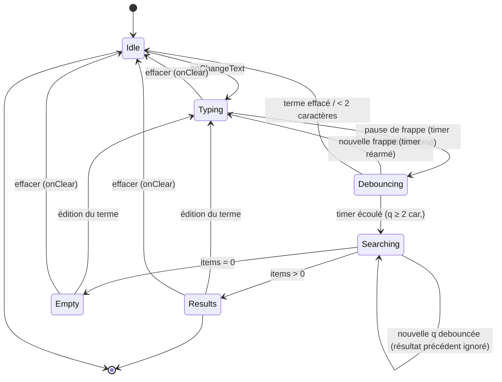
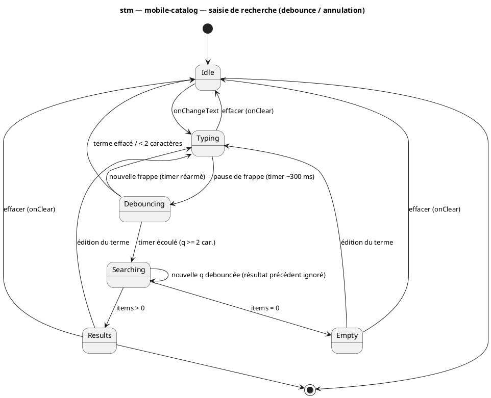

# Diagramme d'états — mobile-catalog — saisie de recherche (debounce / annulation)

> **Périmètre :** machine à états de la **saisie** de recherche (UC2), du clavier à la requête
> **Code concerné (cible) :** `features/beer-catalog/presentation/BeerCatalogSearchScreen.tsx`, `application/useDebouncedValue.ts`
> **ADR liés :** repo ADR-0013 (la conception fait foi)
> **Voir aussi :** `03-sequence-search.md` (séquence) · `10-class-view-model.md` (`SearchVM.status`) · `07-state-list-screen.md` (cycle de vie alimenté) · `../../traceability-matrix.md`

## Contexte

Cycle de vie de la **saisie** de recherche, en amont de la requête. Capture le **debounce**
(on n'appelle pas à chaque frappe) et l'**annulation** (une nouvelle frappe pendant une
requête en vol annule la précédente). Ces états correspondent à `SearchVM.status` (`10`) ;
une fois `Searching` lancé, la **liste de résultats** suit `07-state-list-screen.md`.

## Diagramme (Mermaid — aperçu rapide)

*Même machine en **PlantUML** (à garder synchronisée avec le bloc Mermaid).*

## Notes

- **Debounce.** `Typing → Debouncing → Searching` : la requête ne part qu'après stabilisation
  (`useDebouncedValue`, ≈300 ms). Une frappe continue **réarme** le timer (`Debouncing →
  Typing`), évitant une requête par caractère.
- **Garde « ≥ 2 caractères ».** `Debouncing → Idle` si le terme est trop court → pas d'appel
  (évite aussi le `422` d'un `q` vide côté API).
- **Résultat précédent ignoré (pas un abort réseau).** `Searching → Searching` sur une nouvelle
  `q` debouncée : le changement de `queryKey` (`["beer-catalog","search",q]`) rend la requête
  précédente **inactive** (son résultat est ignoré) ; `keepPreviousData` garde les anciens
  résultats affichés. L'**abort réseau** n'a lieu que si `request()` propage le `AbortSignal` de
  TanStack (à câbler, cf. `03-sequence-search.md`).
- **Vers la liste.** `Searching` lance le hook paginé ; l'affichage des résultats (chargement /
  page suivante / erreur) suit `07-state-list-screen.md`. `Results`/`Empty` ici ≙
  `Loaded`/`LoadedEmpty` là-bas.
- **Conformité.** `SearchVM.status` (`10`) doit exposer exactement ces états. Implémentation
  après validation.
