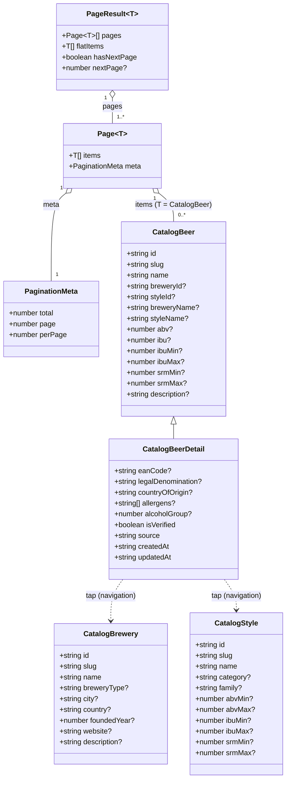
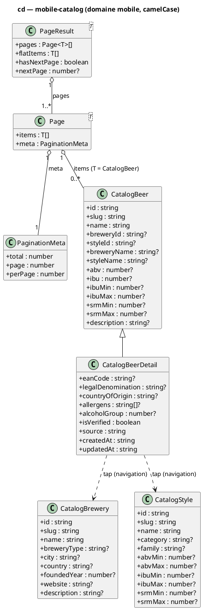

# Diagramme de classes — mobile-catalog — modèle de domaine mobile

> **Périmètre :** types **domaine** de la feature mobile `beer-catalog` (camelCase, après mapping du DTO)
> **Code concerné (cible) :** `packages/mobile-app/src/features/beer-catalog/domain/beer-catalog.types.ts`
> **ADR liés :** repo ADR-0005 (contrat consommé depuis Python), ADR-0017 (intervalles IBU/SRM), repo ADR-0013 (la conception fait foi)
> **Voir aussi :** `../beer-encyclopedia/07-class-api-contract.md` (DTO Pydantic source) · `../beer-encyclopedia/04-class.md` (domaine ORM) · `10-class-view-model.md` (modèle de vue dérivé) · `11-data-flow.md` · `../../traceability-matrix.md`

## Contexte

`../beer-encyclopedia/07-class-api-contract.md` modélise le **DTO** (snake_case, sérialisé par
l'API). Ce diagramme modélise le **domaine mobile** : les types **camelCase** produits par le
mapper et manipulés par l'`application`. Distinct du DTO (forme réseau) et du **view-model**
(`10`, forme d'affichage formatée).

**Décisions modélisées** : (1) `Page~T~` est **générique** — une enveloppe paginée réutilisable
(bières aujourd'hui, brasseries/styles en fast-follow) ; (2) **`PaginationMeta` est dessiné
ici** (camelCase `perPage`) — il était référencé sans être défini dans le contrat backend
(corrigé en parallèle dans `07`) ; (3) `CatalogBeerDetail` **étend** `CatalogBeer` (la liste
porte un sous-ensemble, la fiche le complet) ; (4) `abv` est **parsé `string → number`**, les
intervalles IBU/SRM conservent **bornes + milieu** (ADR-0017).

## Diagramme (Mermaid — aperçu rapide)

*Même modèle en **PlantUML** (notation magistrale). À garder **synchronisé** avec le bloc Mermaid.*

## Notes

- **`PaginationMeta` (camelCase).** `≡ api/schemas/common.PaginationMeta` du contrat backend
  (`07-class-api-contract.md`, où la boîte est dessinée en parallèle) : `perPage` = `per_page`
  après mapping. Contraintes API : `total ≥ 0`, `page ≥ 1` (1-based), `per_page ∈ [1,100]`
  (défaut 20). Le mobile ne renvoie pas `meta` ; il le **lit** pour calculer la page suivante.
- **`Page~T~` / `PageResult~T~`.** `Page~T~` = une page d'API mappée. `PageResult~T~` =
  l'agrégat accumulé par `useInfiniteQuery` (toutes les pages + items aplatis + `hasNextPage` /
  `nextPage` dérivés de `meta`). Générique pour réemploi (brasseries/styles en fast-follow).
  Promotion vers `core/` **seulement** sur un 2ᵉ consommateur (YAGNI).
- **`CatalogBeer` vs `CatalogBeerDetail`.** La **liste** (`GET /beers`) et le **détail**
  (`GET /beers/{id}`) renvoient le même `BeerRead`, mais l'écran liste n'utilise qu'un
  sous-ensemble : `CatalogBeerDetail` **hérite** de `CatalogBeer` et ajoute les champs lourds
  (mentions légales, provenance, horodatage). Permet l'**amorçage du cache** liste → détail
  (`04-sequence-fiche.md`).
- **Transformations (mapper).** `abv: string → number` (Pydantic Decimal sérialise en chaîne) ;
  `ibu = milieu(ibuMin, ibuMax)` pour l'affichage scalaire, **bornes conservées** (ADR-0017) ;
  SRM conservé en bornes (`srmMin`/`srmMax`) — la conversion **SRM → EBC** d'affichage vit au
  **view-model** (`10`), pas au domaine. Noms `breweryName`/`styleName` **dénormalisés** par
  l'API (peuvent être `null` → libellé de repli côté VM).
- **Distinct de l'ORM.** `../beer-encyclopedia/04-class.md` = entités persistées (snake_case,
  FK, contraintes). Ici, vue **client en lecture seule** : pas de FK exécutable, juste
  `breweryId`/`styleId` pour la **navigation** (tap → fiche).
- **Conformité.** `beer-catalog.types.ts` doit correspondre à ce diagramme (`interface` pour
  les formes d'objet, pas de `any`, pas d'export par défaut). Implémentation après validation.
