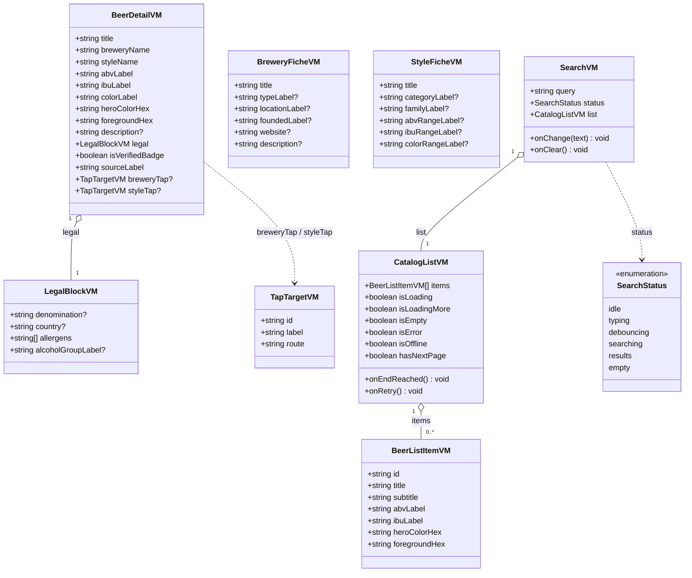
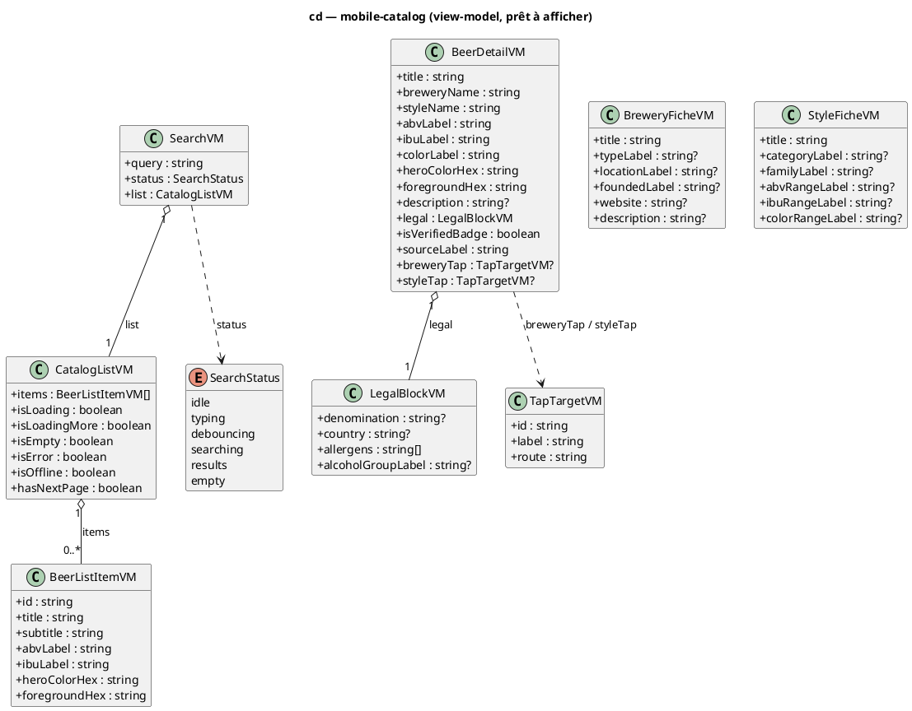

# Diagramme de classes — mobile-catalog — modèle de vue (view-model)

> **Périmètre :** modèle de **vue** consommé par les écrans (formaté, prêt à afficher), distinct du domaine
> **Code concerné (cible) :** `packages/mobile-app/src/features/beer-catalog/presentation/*` + formateurs `application/`
> **ADR liés :** ADR-0017 (intervalles → libellés `20–28`), repo ADR-0013 (la conception fait foi)
> **Voir aussi :** `09-class-domain.md` (domaine source) · `07-state-list-screen.md` · `08-state-search-input.md` · `11-data-flow.md` · `../../traceability-matrix.md`

## Contexte

`09-class-domain.md` donne le **domaine** (camelCase, champs optionnels bruts issus du mapper).
Ce diagramme donne le **view-model** : ce que les écrans **affichent réellement**, après
formatage (libellés `%`, intervalles `20–28`, couleur EBC → hex) et **drapeaux d'UI**
(chargement, vide, erreur, hors-ligne, page suivante).

**Pourquoi un modèle de vue séparé** : le domaine est *nullable/brut* (logique métier) ; la vue
est *formatée/non-null* (présentation). Les **drapeaux** de `CatalogListVM` reflètent
exactement les états de `07-state-list-screen.md`, ceux de `SearchVM` ceux de
`08-state-search-input.md` — la machine à états et le view-model sont **deux vues du même
cycle de vie**. Le formatage réutilise les utilitaires du **scan** (`srmToEbc`, `ebcToHex`,
`formatInterval`).

## Diagramme (Mermaid — aperçu rapide)

*Même modèle en **PlantUML** (notation magistrale). À garder **synchronisé** avec le bloc Mermaid.*

## Notes

- **Domaine → VM = un formateur de l'`application`.** Entrée : `CatalogBeer`/`CatalogBeerDetail`
  (`09`). Sortie : VM non-null prêt à rendre. Exemples : `abvLabel = "5,5 %"` (ou `"—"` si
  null) ; `ibuLabel = formatInterval(ibuMin, ibuMax)` → `"20–28"` / `"22"` / `"—"` ;
  `heroColorHex = ebcToHex(srmToEbc(milieu(srm)))`, `foregroundHex = foregroundOnEbc(...)`
  (helpers du **scan** : `ebcToHex`/`foregroundOnEbc`/`formatInterval` **exportés**, `srmToEbc`/
  `intervalMidpoint` **à extraire** car privés — cf. `11-data-flow.md`) ;
  `subtitle = "<brasserie> · <style>"`.
- **Repli des noms (divergence connue).** `breweryName`/`styleName` sont **`null` aujourd'hui**
  sur `GET /beers`, `/beers/search`, `/beers/{id}` (l'API ne les résout que sur
  `POST /beers/import-by-ean`, cf. `09-class-domain.md` +
  `../beer-encyclopedia/07-class-api-contract.md`). Le VM affiche donc un **libellé de repli**
  (« Brasserie inconnue » / « Style inconnu ») tant que l'API ne les résout pas sur list/search/detail.
- **Drapeaux ≙ machines à états.** `CatalogListVM.{isLoading,isLoadingMore,isEmpty,isError,
  isOffline,hasNextPage}` reflètent les états de `07-state-list-screen.md` ;
  `SearchVM.status` reflète `08-state-search-input.md`. Les drapeaux sont **dérivés** des
  indicateurs TanStack (`isLoading`, `isFetchingNextPage`, `isError`, `data`), pas une FSM
  écrite à la main.
- **`TapTargetVM`** porte le `route` Expo Router (`/(app)/beer-catalog/brewery/<id>` ou
  `/style/<id>`) — la **navigation** UC3 (tap brasserie/style), résolue à la construction du VM
  pour que l'écran ne calcule pas d'URL.
- **`BreweryFicheVM` / `StyleFicheVM`** : fiches secondaires atteintes par navigation.
  `locationLabel = "<ville>, <pays>"`, `colorRangeLabel = "EBC <a>–<b>"`, etc.
- **Conformité.** Le code de `presentation/` consomme ces VM ; le formatage vit en
  `application/`. Implémentation après validation. Pas d'export par défaut, pas de `any`.
