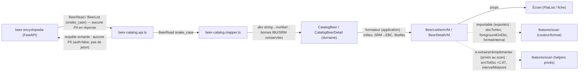
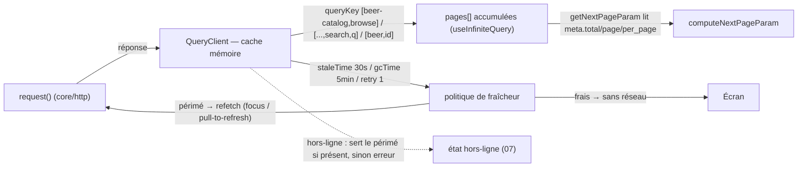
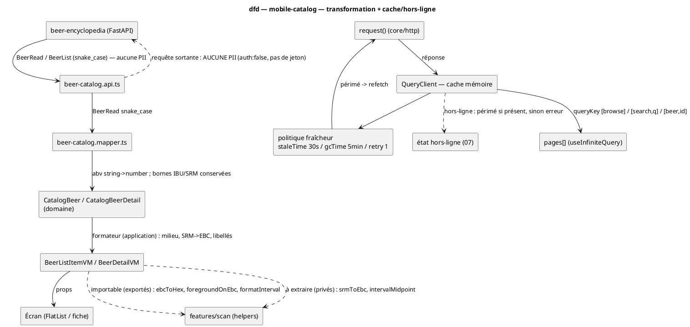

# Data-flow — mobile-catalog — DTO → mapper → domaine → vue + cache / hors-ligne

> **Périmètre :** circulation des données du catalogue (transformation + cache), marquage PII
> **Code concerné (cible) :** `features/beer-catalog/data/beer-catalog.{api,mapper}.ts`, `application/*` (formateurs VM), `core/query`
> **ADR liés :** repo ADR-0005 (lecture publique, sans auth), ADR-0017 (intervalles), repo ADR-0013 (la conception fait foi)
> **Voir aussi :** `09-class-domain.md` (domaine) · `10-class-view-model.md` (VM) · `02-sequence-browse.md` · `05-sequence-errors.md` · `../../traceability-matrix.md`

## Contexte

Deux flux complémentaires : **(A) transformation** (forme réseau → forme d'affichage) et
**(B) cache / hors-ligne** (TanStack). Le data-flow **force le marquage PII** : ici la lecture
catalogue **ne transporte aucune PII** (`auth:false`, **aucun jeton, aucune identité**
envoyée) — c'est le point à vérifier en revue. Les conversions SRM→EBC et milieu d'intervalle
sont **réutilisées du scan** (pas de duplication d'algorithme).

## Diagramme A — transformation (Mermaid)

## Diagramme B — cache / hors-ligne (Mermaid)

*Mêmes flux en **PlantUML** (à garder synchronisés avec les blocs Mermaid).*

## Notes

- **PII : aucune.** La lecture catalogue est **publique** (`auth:false`, ADR-0005) : la requête
  sortante **ne porte ni jeton ni identité utilisateur**, la réponse ne contient que des faits
  bière publics. Aucune arête `PII:` — contrairement aux flux authentifiés (recettes, brassins)
  qui restent hors de cette feature. Point de **revue de confidentialité** : vérifier qu'aucun
  en-tête d'auth ne fuit (la garde `auth:false` de `request()` l'assure).
- **Réutilisation des helpers du scan — deux cas (vérifié).** **Importables tels quels**
  (exportés) : `ebcToHex` / `foregroundOnEbc` (`features/scan/application/lookup-color.ts`) et
  `formatInterval` (`features/scan/application/lookup-formatters.ts`). **À extraire ou
  réimplémenter** (actuellement **privés**, non exportés, dans
  `features/scan/data/beers-import.api.ts`) : `srmToEbc` (×1.97) et `intervalMidpoint`.
  Réutilisation **algorithmique** (même formule), pas un import d'un symbole privé. Ces
  dérivations (milieu, SRM→EBC, libellés) vivent au **view-model** (`10`), pas au mapper ;
  les mappers restent dupliqués vers `CatalogBeer` (pas `ScanCatalogItem`).
- **Cache en mémoire.** `staleTime 30s`, `gcTime 5min`, `retry 1` (`core/query`). Pas
  d'`AsyncStorage` : « hors-ligne avec contenu » n'existe que dans la session. Persistance
  hors-ligne = **fast-follow** (déclencherait un court ADR si elle devient une garantie produit).
- **Pagination.** `getNextPageParam` lit `meta` (`total/page/per_page`) → `computeNextPageParam`
  (1-based). Cf. `02-sequence-browse.md`, `09-class-domain.md`.
- **Conformité.** Mapper et formateurs doivent suivre ce flux ; aucun `fetch` direct (egress
  unique `request()`, `06-component.md`). Implémentation après validation.
