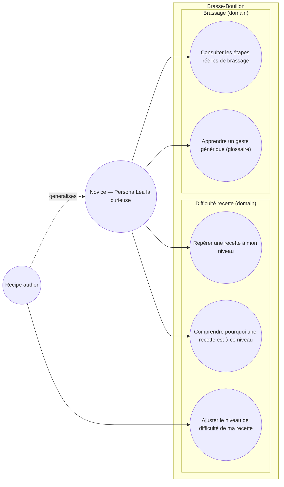

# Use case diagram — recipe-difficulty — who reads/sets a recipe's difficulty

> **Feature**: recipe difficulty badge (screen-review Tranche B)
> **Source specs**: `docs/architecture/specs/recipe-difficulty-algorithm.md`
> **Related ADRs**: ADR-0024
> **Decisions captured**: D1–D5 (ADR-0024)

## Context

Who interacts with the difficulty badge and the simplified Brassage tab, and to what goal.
Computing the difficulty is a **system behaviour** (triggered by create/update), not an
actor goal — it is shown in the sequence/component diagrams, **not** here. Grouped by domain,
never by backend package (UML 2.5).

## Diagram

## Notes

- **UC1** reads the badge on recipe cards / hero to self-select; **UC2** is the tap-to-explain
  (« Avancé car : … ») — the pedagogical payload (`feedback_educational_vocation`).
- **UC3** is the author override (ADR-0024 D3); `Author` is an actor **generalisation** of
  `Novice` (an author is also a reader) — linked only to its own extra goal.
- **UC5** « Apprendre un geste générique » lives in the **Academy** (ADR-0023): the generic
  brewing-phase glossary moves out of the Brassage tab (ADR-0024 D5). Shown here to record the
  hand-off; its realization is the Academy feature, not this one.
- No « Recevoir/Voir le badge » use case — a badge is displayed state, not an actor-initiated
  goal; the reader's goal is UC1 (repérer) / UC2 (comprendre).
- The `Author -.-> Novice` dashed arrow is a Mermaid **approximation** of UML actor
  generalisation (UML draws a solid line with a hollow triangle, which Mermaid flowcharts
  cannot render). Read it as "Author is a Novice too", not a dependency.
