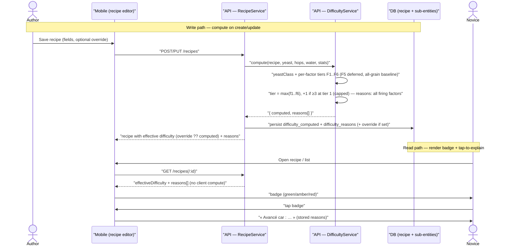

# Sequence diagram — recipe-difficulty — compute on save & read on display

> **Feature**: recipe difficulty badge (screen-review Tranche B)
> **Source specs**: `docs/architecture/specs/recipe-difficulty-algorithm.md`
> **Related ADRs**: ADR-0024, ADR-0002, ADR-0020
> **Decisions captured**: D1–D4 (ADR-0024)

## Context

The two flows that matter in time: (1) the backend **computes and stores** difficulty +
reasons when a recipe is created/updated (never on the client), and (2) the mobile **reads**
the stored effective level + reasons to render the badge and its tap-to-explain. Author
override is the branch on the write side. A simple read of a static field on other screens is
trivial and not diagrammed (proportionality).

## Diagram

## Notes

- **Compute is server-side only** (ADR-0002 / ADR-0020) — the mobile never runs the rules; it
  consumes `effectiveDifficulty` + `reasons`. This is the anti-pattern the diagram makes
  visible: any client-side difficulty computation would be a bug.
- `reasons[]` is **stored** on write (not recomputed on read) so tap-to-explain is a plain read
  (ADR-0024 D3).
- **Override branch**: if the author set `difficulty_override`, the API returns it as the
  effective level but keeps `difficulty_computed` for the « calculé : … » hint.
- The `compute()` call is synchronous within the create/update transaction — difficulty is a
  pure function of the recipe, so no async job is warranted (ADR-0001, YAGNI).
