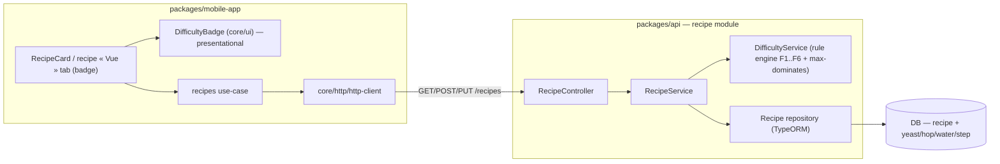

# Component diagram — recipe-difficulty — where the rule engine lives

> **Feature**: recipe difficulty badge (screen-review Tranche B)
> **Source specs**: `docs/architecture/specs/recipe-difficulty-algorithm.md`
> **Related ADRs**: ADR-0024, ADR-0002
> **Decisions captured**: D1, D3 (ADR-0024)

## Context

Structural boundaries: the **`DifficultyService`** rule engine is a backend component owned by
the recipe module (the math lives server-side, ADR-0002 / ADR-0020); the mobile holds only a
**presentational** badge that reads the computed field. Grouped by layer.

## Diagram

## Notes

- **`DifficultyService`** is a pure function of the recipe + its sub-entities → trivially unit
  testable (ADR-0019, H/S/E). No external calls, no I/O.
- The mobile **`DifficultyBadge`** is presentational only (colour + label + tap-to-explain from
  the stored `reasons`); it does **not** import any scoring logic — the egress point is the
  single `http-client` (forbidden-pattern guard: no direct `fetch`, no client-side compute).
- No new package, no new external dependency — the engine is a service inside the existing
  recipe module (ADR-0001).
