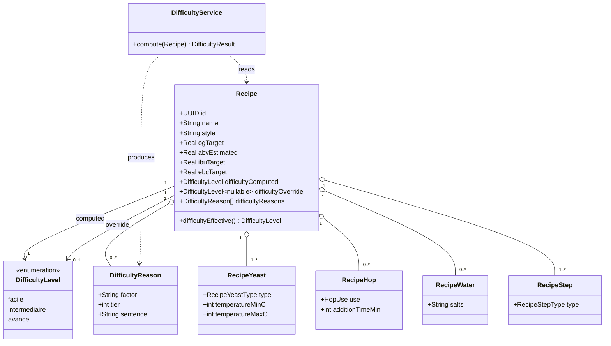

# Class diagram — recipe-difficulty — data model & compute inputs

> **Feature**: recipe difficulty badge (screen-review Tranche B)
> **Source specs**: `docs/architecture/specs/recipe-difficulty-algorithm.md`
> **Related ADRs**: ADR-0024
> **Decisions captured**: D2, D3, D4 (ADR-0024)

## Context

The additions to the recipe model (three fields) and the existing sub-entities the rule engine
reads. Only `Recipe` gains fields; the sub-entities are unchanged (all signals already exist —
all-grain baseline, no `brewMethod`).

## Diagram

## Notes

- **New on `Recipe`**: `difficultyComputed` (not null), `difficultyOverride` (nullable),
  `difficultyReasons` (json). `difficultyEffective()` = `override ?? computed` (ADR-0024 D3).
- **`DifficultyReason`** is the stored breakdown that feeds tap-to-explain — computed on write,
  read as-is (no client compute).
- The sub-entities (`RecipeYeast.type`/temps, `RecipeHop.use`, `RecipeWater`, `RecipeStep.type`,
  and `ibuTarget`/`ebcTarget`/`ogTarget` on `Recipe`) are the rule-engine inputs (spec §F1–F6) —
  **unchanged** by this feature.
- `DifficultyService` holds no state — a pure function (ADR-0024 D1), which is why it is a
  service, not an entity.
