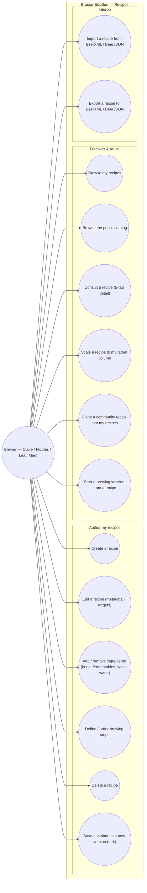

# Use-case diagram — recipes — author, discover, clone & version

> **Feature**: epic #740 (Mes Recettes hub + detail); recipe write CRUD
> #410–#420; community clone/version #739 #882 #883; BeerXML I/O #778 #865 #881.
> **Personas**: Claire (creative — versioning/forks), Nicolas (repeatable),
> Léa (discover/clone), Marc (BeerXML migration).

## Context

Who interacts with recipes and to do what. Goals are actor-initiated (UML 2.5).
Grouped by domain (Recipes), with sub-groups: Author (own recipes), Discover
(catalog + clone), Interop (BeerXML). The Mobile/API split is in `03-component.md`,
not here. Read paths exist today; write CRUD + clone-UX + BeerXML are the open
goals this models so implementation has a target.

## Diagram

## Notes

- **Status today** (see `06-status` note in PR): UC7–UC12 (read/list/scale/clone/
  start) are implemented; **UC1–UC6 (write CRUD + fork) have backend endpoints
  but no mobile UI** — the central open gap (#410–#420). UC13/UC14 (BeerXML) are
  planned (#778/#865/#881).
- **Clone vs fork** are distinct goals: UC11 *clone a community recipe* deep-copies
  a public recipe into a **new private root** (own lineage, provenance kept); UC6
  *fork* creates a **new version within my own lineage** (`version+1`,
  `parentRecipeId` → source). Both reuse the same versioning model (class diagram).
- **UC12 (start a session)** is the hand-off to the brewing-session feature — its
  own use-case set lives in `diagrams/brewing-session/`.
- **No `Beer` actor/entity**: recipes are the core unit; the old "Recipe.cloneOf →
  Beer.id" note is superseded by the root/parent versioning model.
