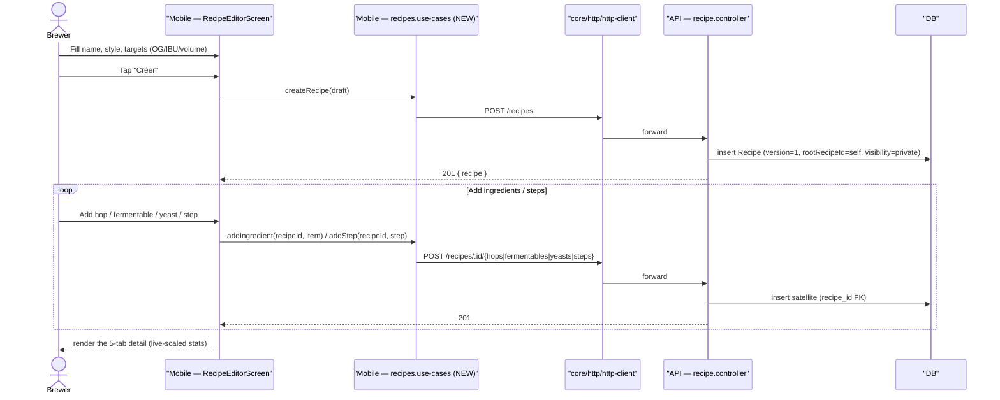

# Sequence diagram — recipes — create a recipe & fork a version

> **Feature**: write CRUD #410–#420; fork/versioning #882 #883.
> **Source**: `recipes.use-cases.ts`, `recipes.api.ts`, `recipe.service.ts`.

## Context

The write path the mobile app is missing today: create a recipe then populate
its ingredients/steps, and fork an existing recipe into a new version. Backend
endpoints already exist (POST/PATCH/DELETE) — this models the mobile use-cases +
egress to add. Read/scale/clone-from-community already work and are not repeated
here.

## Create & populate a recipe



## Fork a recipe into a new version

```mermaid
sequenceDiagram
  actor B as Brewer
  participant S as "Mobile — RecipeDetailsScreen"
  participant UC as "Mobile — recipes.use-cases (NEW)"
  participant HTTP as "core/http/http-client"
  participant API as "API — recipe.controller"
  participant DB as "DB"

  B->>S: Tap "Enregistrer comme nouvelle version"
  S->>UC: forkRecipe(sourceId)
  UC->>HTTP: POST /recipes/:id/fork
  HTTP->>API: forward
  API->>DB: deep-copy satellites; new Recipe (version+1, same rootRecipeId, parentRecipeId=source)
  API-->>S: 201 { recipe }
  S-->>B: open the new version in the editor
```

## Notes

- **Egress rule**: screen → use-case → `core/http/http-client`; never a direct
  `fetch` (project rule; see `03-component.md`).
- **Demo mode**: the new write use-cases must branch on `dataSource.useDemoData`
  and mutate the in-memory demo recipes (existing pattern) so the demo works
  offline.
- **Clone-from-community** (#601, already implemented) is a sibling of *fork*: it
  deep-copies a *public* recipe into a **new private root**, whereas *fork* stays
  within the user's lineage (`version+1`). Both land on the same satellite
  deep-copy logic server-side.
- **Validation**: targets (OG/FG/IBU/volume) validated client + server; a recipe
  with no fermentable cannot be marked brewable (acceptance criterion for #410).
