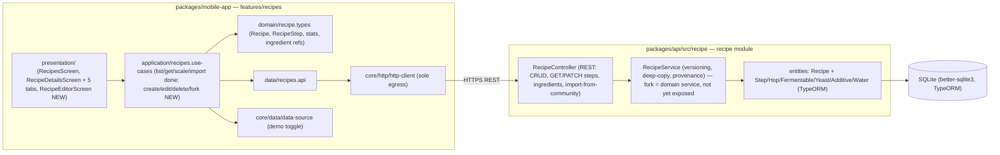

# Component diagram — recipes — structure & boundaries

> **Feature**: epic #740; write CRUD #410–#420.
> **ADRs**: ADR-0002 (centralized NestJS backend), ADR-0005 (recipes are product
> data → product API, not the encyclopedia).

## Context

How the recipes feature is structured across packages and layers. Confirms the
single network egress and the Clean Architecture layering. Same shape as the
brewing-session component diagram (consistency is intentional).

## Diagram

## Notes

- **Egress**: all recipe network calls go through `data/recipes.api` →
  `core/http/http-client`. No direct `fetch` in screens.
- **Gap made visible**: the mobile `application` + `presentation` write path
  (create/edit/delete + RecipeEditorScreen) is the missing layer — the backend
  already exposes **create/update/delete + GET/PATCH steps + import-from-community**.
  **Fork is not yet a REST route** (only a pure domain service today, #882/#883) —
  it needs both an endpoint and the mobile UI.
- **ADR-0005**: recipe data is product data → `packages/api`, never the
  beer-encyclopedia service. The encyclopedia only feeds *scan* matching (a
  recipe's `style` tag is used there, read-only).
- **Demo toggle** mirrors every other feature: use-cases short-circuit to
  `demoRecipes` when `useDemoData`.
