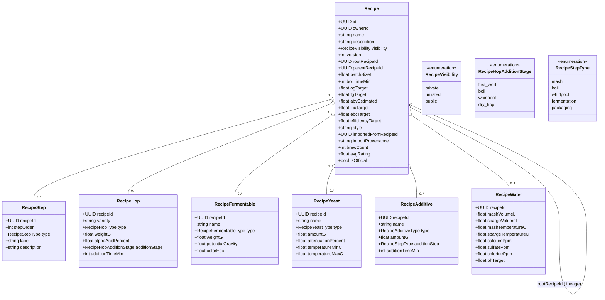

# Class diagram — recipes — domain model & versioning

> **Feature**: epic #740; versioning #882 #883; write CRUD #410–#420.
> **Source**: `packages/api/src/recipe/entities/*` and
> `packages/mobile-app/src/features/recipes/domain/recipe.types.ts`.

## Context

The recipe aggregate and its ingredient/step satellites, plus the
root/parent/version lineage that powers clone and fork. Reflects the **existing**
schema (not a proposal) so the write-CRUD UI maps onto real tables. The 9-phase
`RecipeStepType` extension is the brewing-session decision D1, not made here.

## Diagram

## Notes

- **Versioning** is the two self-references: `rootRecipeId` (first recipe of the
  lineage, immutable) + `parentRecipeId` (direct parent). A fork = new Recipe,
  `version+1`, same `rootRecipeId`, `parentRecipeId` = source. No mutation of the
  source — variants are first-class rows.
- **Clone from community** (#601, implemented): deep-copies all satellites into a
  **new private root** (`rootRecipeId = newId`, `parentRecipeId = null`,
  `version = 1`); provenance kept in `importedFromRecipeId` + `importProvenance`.
- **Ingredient satellites** are one-to-many by `recipeId` FK; `RecipeWater` is
  0..1 (one water profile per recipe). Enums shown are the load-bearing ones;
  fermentable/yeast/additive type enums omitted for space (exist in the API).
- **`RecipeStepType` (5 values)** is shared with the brewing session; its 9-phase
  extension is brewing-session **D1** (ADR before build), not decided here.
