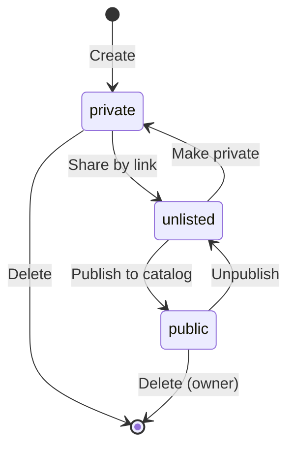
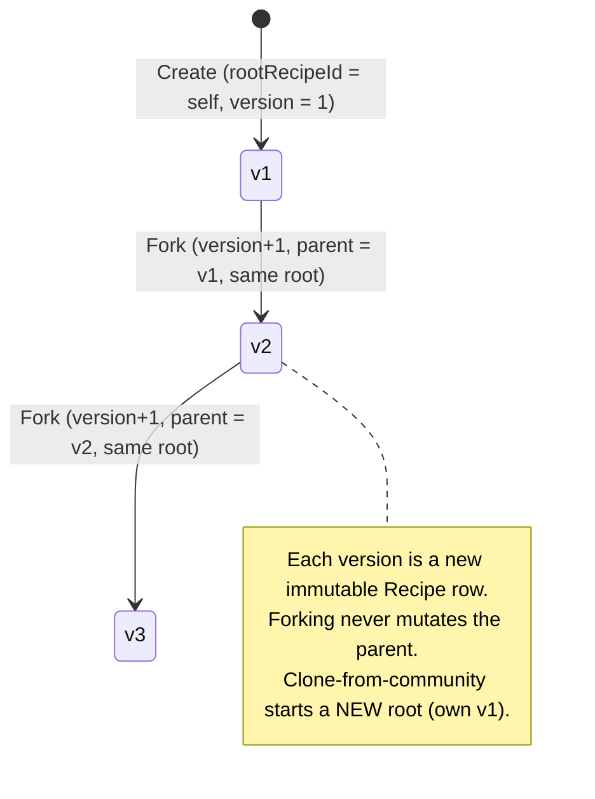

# State diagram — recipes — visibility & version lineage

> **Feature**: epic #740; visibility model (existing); fork/versioning #882 #883.

## Context

A recipe's two orthogonal lifecycles: its **visibility** (who can see it) and its
**version lineage** (how variants relate). Recipes have no heavy state machine
beyond these; capturing them prevents accidental mutation-in-place of shared
recipes.

## Visibility

## Version lineage (fork)

## Notes

- **Visibility transitions** are owner-initiated; publishing to `public` is what
  makes a recipe clonable by others (clone → a new private root for the cloner).
- **Versions are append-only rows**, not in-place edits of a shared recipe — this
  is the guarantee that a public recipe others have cloned cannot change under
  them. Editing your *own* private recipe is a normal PATCH (not a fork); a fork
  is an explicit "save as new version".
- **Delete**: removing a recipe cascades to its satellites; deleting a `root`
  with descendants is a product decision (block, or re-root children) — flag as
  an open question for the write-CRUD epic (#420).
