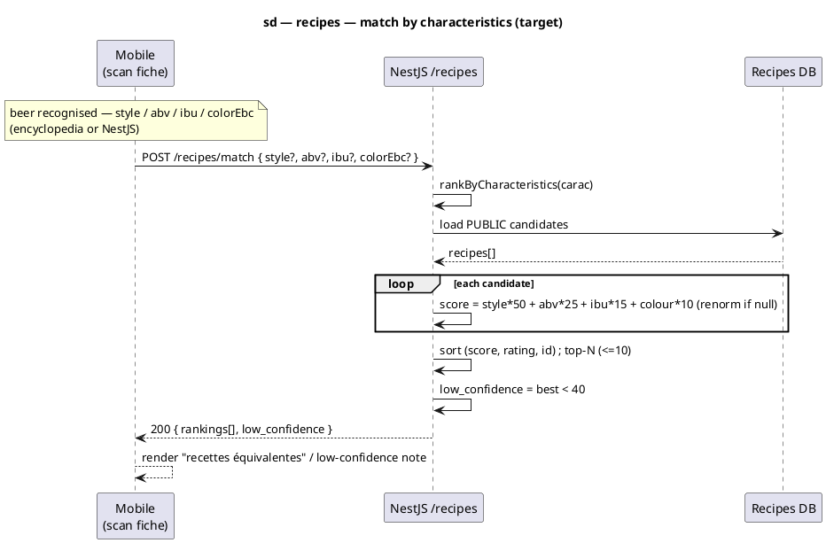

# Sequence diagram — recipes — Match community recipes to a beer (by characteristics)

> **Feature**: epic #740; matching algorithm #699; scan cutover #1186 (this decoupling).
> **Code**: `src/recipe/services/recipe-matching.service.ts`, `src/recipe/controllers/recipe.controller.ts`; mobile `features/scan/data/recipe-matching.api.ts`.
> **ADRs**: ADR-0005 (recipes are product data → NestJS), ADR-0013 (conception is the contract).
> **See also**: `../beer-encyclopedia/08-sequence-mobile-scan.md` (the scan fiche that triggers this), `../../traceability-matrix.md`.

## Context

The scan fiche ("recettes équivalentes") ranks community recipes against the **scanned beer**.
The ranking algorithm (#699) scores each recipe purely on the beer's **characteristics** —
`style × 50 + ABV × 25 + IBU × 15 + colour × 10` (weights renormalised when a criterion is
missing). It never needs the beer's identity, only those four values.

**Target decision (this diagram).** The match endpoint takes the **characteristics directly**,
not a `scan_catalog_items` id. Reason: the scan cutover (#1186) makes the mobile resolve a
barcode against the **beer-encyclopedia**, whose `BeerRead` carries a Python `beers` UUID that
is **absent** from NestJS `scan_catalog_items` — so the legacy `GET /recipes/match/:beerId`
(which `findOne`s a scan-catalog row by id) 404s for every encyclopedia-sourced beer. Passing
the characteristics removes that coupling and keeps matching working for **any** source
(encyclopedia, NestJS, or a future one).

The legacy id-based route stays as a thin wrapper (load the scan-catalog row → delegate to the
same scorer) until the NestJS scan path is retired (#1186 step 2).

## Diagram (Mermaid)

```mermaid
sequenceDiagram
  autonumber
  participant M as Mobile (scan fiche)
  participant API as NestJS /recipes
  participant DB as Recipes DB

  Note over M: beer recognised — has style / abv / ibu / colorEbc<br/>(from the encyclopedia or NestJS)
  M->>API: POST /recipes/match { style?, abv?, ibu?, colorEbc? }
  API->>API: rankByCharacteristics(carac)
  API->>DB: load PUBLIC candidate recipes
  DB-->>API: recipes[]
  loop each candidate
    API->>API: score = style×50 + abv×25 + ibu×15 + colour×10 (renorm if a criterion is null)
  end
  API->>API: sort desc (score, then rating, then id) ; take top-N (≤10)
  API->>API: low_confidence = best score < 40
  API-->>M: 200 { rankings[], low_confidence }
  M-->>M: render "recettes équivalentes" (or the low-confidence note)
```

_Same flow in **PlantUML** (keep synchronised with the Mermaid block)._



## Notes

- **Inputs (all optional, all nullable).** `style: string`, `abv: number`, `ibu: number`,
  `colorEbc: number`. The mobile maps EBC ↔ the API's colour unit consistently with the scan
  fiche (`ScanCatalogItem.colorEbc`). A missing criterion is dropped and the remaining weights
  are renormalised — so a beer with only style + abv still ranks.
- **Scoring (mostly) unchanged.** `rankByCharacteristics` is the existing scorer extracted out
  of `rankForBeer`; sub-scores, weights, and the `low_confidence` (< 40) rule are identical.
  Only the **source** of the characteristics changes.
- **Style-gated official promotion (#1193).** The official-recipe shortcut (similarity = 100)
  applies **only when the official is style-compatible** (the style sub-score is positive). An
  off-style official (e.g. an IPA for a Leffe Blonde) is ranked on its honest similarity
  instead, so it no longer floats above a genuine same-style match. Style-compatible officials
  stay promoted.
- **Backward compatibility.** `GET /recipes/match/:beerId` stays: it loads the
  `scan_catalog_items` row, then calls `rankByCharacteristics(row)`. Removed when the NestJS
  scan path is retired (#1186 step 2). No behaviour change for existing callers.
- **Why not key off the beer id.** Identity is not a matching input; coupling to
  `scan_catalog_items` is exactly what blocks the encyclopedia cutover. Characteristics are
  source-agnostic.
- **Conformance.** The code (`recipe-matching.service.ts` + the controller + the mobile data
  layer) must satisfy this contract: a characteristics endpoint, the scorer shared with the
  legacy route. Implementation follows validation of this diagram.
